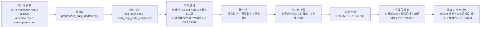
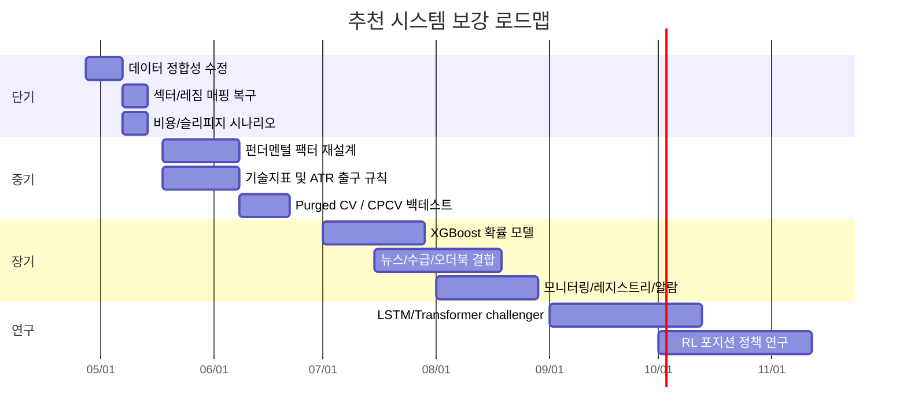

# 주식 종목 추천 프로그램 보강 방안과 매수·매도 타이밍 개선

## Executive summary

업로드된 개발 매뉴얼과 일일 산출물 스냅샷을 기준으로 보면, 현재 시스템은 **규칙·점수 기반의 일일 배치형 추천 엔진**으로 이미 꽤 잘 정리되어 있습니다. EPS 수집 우선순위, DART 연동 캐시, 기술·밸류 점수, 일일 리포트 자동화, 30일 타임라인과 전일 비교 산출물까지 갖추고 있어 “연구용 프로토타입” 단계를 넘어서 **운영형 리서치 툴**에 가깝습니다. 다만 지금 단계의 가장 큰 병목은 모델의 복잡도가 아니라 **데이터 품질과 의사결정 로직의 구조적 일관성**입니다.

업로드 파일을 직접 분석한 결과, 지금 당장 손봐야 할 항목은 다섯 가지입니다. 첫째, **섹터 구조가 사실상 죽어 있습니다**. 전체 779개 종목의 `섹터그룹`이 모두 `기타`이고 `섹터PER상한`도 단일 값으로 고정되어 있어, 섹터 상대가치 비교가 작동하지 않습니다. 둘째, **손실 플래그가 오작동합니다**. `모델EPS`와 `현재PER`가 음수인 종목이 206개인데 `적자여부`는 전 종목 0입니다. 셋째, **`결합액션=제외`인데도 비중 0.75%가 부여된 종목이 365개**라서 포트폴리오 규칙과 액션 분류가 불일치합니다. 넷째, **시장 레짐이 전 종목 `BULL`, 배수 1.0**으로 고정되어 레짐 오버레이가 비활성 상태입니다. 다섯째, **신호 라이브러리의 기대값이 상충**합니다. `돌파+거래량+RSI안전` 신호는 파일상 “높음” 신뢰도로 표시되지만 5일 기대값은 음수입니다. 이 다섯 가지는 지표를 더 얹기 전에 반드시 수정해야 합니다.

보강 우선순위는 명확합니다. **단기적으로는** 데이터 계층과 룰 계층을 정리해야 합니다. 손실 플래그, 섹터 매핑, run date와 trade date 분리, 액션-비중 일치, 거래비용·슬리피지 반영이 1순위입니다. **중기적으로는** EPS 단일축을 버리고 `TTM 희석 EPS 성장률 + EPS 변동성 + ROE/영업수익성 + FCF + 부채/이자보상 + 희석/주식수 변화 + 섹터상대 밸류`의 복합 품질·밸류 프레임으로 전환해야 합니다. 회계적으로 EPS는 중요하지만, EPS만 보면 발생주의 왜곡, 일회성 이익, 희석, 분기 변동성, 업종 간 비비교성 문제를 피할 수 없습니다. K-IFRS와 IAS 33는 기본·희석 EPS를 구분해 공시하도록 하고, DART는 분·반기·사업보고서 재무정보를 2015년 이후 API로 제공합니다. 수익성·현금흐름·투자·품질 팩터가 설명력을 가진다는 고전 연구도 이 방향을 뒷받침합니다. citeturn7search0turn7search2turn7search1turn16search5turn3search0turn3search1turn3search2turn21search0turn4search10

**매수·매도 타이밍**은 더 많은 지표를 더하는 방식보다 **게이트형 설계**가 좋습니다. 추천 구조는 “유니버스 필터 → 펀더멘털 게이트 → 추세/돌파 게이트 → 실행 품질 게이트 → 리스크/사이징”의 5단 구조입니다. 기술지표는 MA 스택·MACD·RSI·볼린저·ATR·OBV·ADX·VWAP·Ichimoku를 모두 쓸 수 있지만, 서로 다른 역할로 분리해야 합니다. 추세 판정은 MA/Ichimoku/ADX, 진입 타이밍은 돌파·거래량·VWAP, 손절과 트레일링은 ATR, 미세한 과열·되돌림은 RSI/볼린저가 담당해야 합니다. 실무 기본값은 TA-Lib 표준값인 RSI 14, MACD 12/26/9, ADX 14, ATR 14, Bollinger 20/2에서 시작하는 편이 안전합니다. 기술 규칙은 역사적으로 일부 예측력을 보여 왔지만, 데이터 스누핑과 과최적화에 취약하므로 다중 규칙 비교에는 White Reality Check, Hansen SPA, Deflated Sharpe Ratio 같은 검정을 반드시 붙여야 합니다. citeturn5search0turn5search1turn15search0turn15search1turn6search2turn6search3turn9search0turn9search1turn8search0turn8search1turn8search2

모델은 **바로 딥러닝으로 가지 말고, XGBoost를 1차 기준선으로 세우는 것이 가장 실무적**입니다. 현재 시스템은 룰 기반이므로, 다음 단계는 “룰을 대체”하기보다 **룰 위에 확률 추정기를 올리는 2단 구조**가 더 적합합니다. 즉, 현재 규칙으로 후보를 좁힌 뒤 XGBoost나 랜덤포레스트로 “향후 20거래일 내 상단배리어 도달 확률”을 예측하고, 그 확률을 진입 임계치·비중·매도 우선순위에 반영하는 식입니다. LSTM과 Transformer는 후보군으로 좋지만 데이터가 커지고 시퀀스·종목 간 상호작용이 충분히 쌓일 때 의미가 커집니다. RL은 마지막 단계가 맞습니다. 최근 비교 연구와 설문 연구에서도 다종목 예측에서는 앙상블 트리 계열이 강한 기준선이 되는 경우가 많고, RL은 보상함수와 비용모형 현실화가 핵심 병목으로 지적됩니다. citeturn10search12turn10search14turn10search3turn19search0turn19search1

가장 비용 대비 효과가 큰 실행 계획은 다음과 같습니다. **첫 달**에는 데이터/룰 정합성 수정과 보수적 백테스트 체계 확립, **둘째 달**에는 펀더멘털/기술지표 복합화와 ATR 기반 손절·트레일링, **셋째 달 이후**에는 XGBoost 확률 모델과 뉴스·수급·미시구조 데이터 통합입니다. 공식 데이터 원천은 entity["organization","금융감독원","seoul, south korea"] OpenDART, entity["organization","한국거래소","seoul, south korea"] Data Marketplace, entity["organization","한국회계기준원","seoul, south korea"] K-IFRS, entity["organization","IFRS Foundation","london, united kingdom"] IAS 33, entity["organization","금융투자협회","seoul, south korea"] 컴플라이언스 자료를 우선으로 두는 것이 맞습니다. OpenDART는 corpCode.xml, 기업개황, 정기보고서 재무정보를 제공하고, KRX는 가격·투자자별 거래·외국인 보유량·PER/PBR·공매도·옵션 지표·호가장/체결장까지 제공하므로, 현재 보조적으로 쓰는 yfinance 의존도는 점진적으로 줄이는 편이 바람직합니다. citeturn16search2turn16search1turn16search5turn1search2turn1search6turn14search0turn14search1turn22search0turn22search3turn17search12turn13search1turn13search2turn13search17

## 분석 범위와 가정

이번 분석은 업로드된 다음 산출물을 직접 읽어 현재 상태를 파악한 뒤, 공시·거래·회계·기술분석·백테스트 분야의 공식 문서와 학술자료로 보강한 것입니다.

| 분석 대상 | 확인 내용 | 이번 보고서에서의 사용 방식 |
|---|---|---|
| `신규_개발_재구축_매뉴얼.md` | 파이프라인, EPS 우선순위, 점수 체계, 액션 기준, 스케줄링 | 현재 구조 진단의 기준 |
| `상세리포트_2026-04-25.csv` | 전체 유니버스 779종목의 지표·점수·액션·비중 | 시스템 스냅샷 정량 진단 |
| `종목선정_핵심근거_2026-04-25.csv` | 신호별 신뢰도·5일 승률·기대값·설명 문구 | 신호 라이브러리 상태 점검 |
| `최종매수_30일타임라인_2026-04-25.csv` | 최종매수후보의 최근 30거래일 돌파·거래량 추이 | 타이밍·지속성 점검 |
| `최종매수_전일비교_2026-04-25_vs_2026-04-24.csv` | 유지/신규/이탈 및 점수 변화 | 신호 안정성 점검 |

세부 조건이 명시되지 않은 항목은 아래처럼 가정했습니다. 이 가정은 **성능을 좋게 보이게 하기보다 보수적으로 검증하기 위한 기본값**입니다.

| 항목 | 기본 가정 |
|---|---|
| 백테스트 기간 | 2015-01-01 이후~최신 영업일. DART 재무 API가 2015년 이후를 공식 제공하므로 DART-only 체계의 기준 기간으로 설정 |
| 시그널 생성 시점 | 당일 종가 기준 계산, **다음 거래일 시가**에 체결 |
| 거래비용 베이스 시나리오 | 수수료·유관기관 비용 5bp/side, 슬리피지 KOSPI 10bp/side, KOSDAQ 15bp/side |
| 거래비용 보수 시나리오 | 베이스의 2배 슬리피지 |
| 최소 유동성 | 20일 평균 거래대금 20억 원 미만 종목은 실거래 후보에서 제외 또는 paper-only |
| 라벨 기준 | 기본은 20거래일, 비교용으로 5/10/20/60거래일 병행 |
| 포트폴리오 유형 | 현물 long-only, 무레버리지 |
| 섹터 정책 | REIT-only 제외 대신, 중기부터는 업종별 밸류 규칙 분리 |

OpenDART는 기업 고유번호 corpCode.xml과 기업개황, 정기보고서 재무정보 API를 제공하며, 정기보고서 재무정보는 2015년 이후 분기·반기·3분기·연차 보고서 코드를 명시합니다. KRX Data Marketplace는 시세·투자자별 거래실적·외국인 보유량·PER/PBR/배당수익률·공매도·파생 지표와 정형 데이터 상품을 제공합니다. 이 구조를 전제로 하면, 장기 백테스트와 실시간 운영의 기준 원천은 DART와 KRX가 되어야 하고, 비공식 소스는 예비 또는 fallback 계층으로 두는 편이 안전합니다. citeturn16search2turn16search5turn1search0turn1search2turn1search6turn14search1turn22search0

## 현재 시스템 진단

현재 구조를 한 문장으로 요약하면, **“EPS 기반 밸류 점수 + 기술 점수 + 규칙형 액션 분류를 일일 배치로 산출하는 엔진”**입니다. 이 구조 자체는 나쁘지 않습니다. 오히려 룰 기반이기 때문에 설명 가능성과 운영 안정성이 있습니다. 문제는 “무엇을 더 넣을까”보다 먼저 **현재 룰과 데이터가 서로 정합적인가**입니다.



현재 시스템의 핵심 구조를 실무 관점으로 정리하면 아래와 같습니다.

| 구분 | 업로드 파일상 현재 상태 | 실무 평가 |
|---|---|---|
| 실행 구조 | `preprocess_daily_updates.py → build_daily_report.py` 일일 실행, EPS/assumption 월간 갱신 | 운영형 배치 파이프라인으로는 적절 |
| EPS 정책 | `manual_forward_eps → trailing_eps_dart → consensus_eps_scrape → forward_eps_auto` | 정책은 합리적이지만 실제 스냅샷에선 trailing DART 의존도가 과도 |
| 기술 입력 | 20/60/120/200일 이평, MA200 상단 여부, RSI14, MACD histogram, 거래량비율20일, 20일돌파, 5일/20일 수익률, 상대강도20일 | 핵심 추세·모멘텀은 들어가 있으나 방향/강도/변동성/실행 품질 분업이 약함 |
| 밸류 입력 | 후행 EPS, 컨센서스 EPS, 자동선행 EPS, 현재 PER, 적정주가, 상승여력 | EPS 하나에 과도하게 의존하며 품질/현금흐름/희석/부채가 빠짐 |
| 점수 체계 | 기술점수는 추세 55, RSI 15, MACD 10, 거래량 10, 20일 돌파 10 | 구조는 이해 가능하나 많은 정보를 한 점수에 평균해 의사결정 경계가 흐려질 위험 |
| 액션 기준 | 최종매수후보 `score>=75` + MA200 상단 + 20일 돌파 + EPS 존재 / 진입대기 `score>=65` + MA200 상단 + EPS 존재 / 관찰 `score>=50` 또는 EPS 결측 | “게이트” 아이디어가 이미 부분적으로 존재. 이를 더 엄격한 단계형 구조로 발전시키면 좋음 |
| 출력물 | 상세리포트, 핵심근거, 30일 타임라인, 전일 비교 | 운영·설명 가능성 측면에서 장점이 큼 |
| 학습/검증 | 업로드 파일상 명시적 지도학습 모델, 학습셋, 검증셋, 비용 반영 백테스트 메타데이터는 확인되지 않음 | 현재는 룰 엔진으로 보는 것이 정확 |
| 백테스트 흔적 | 핵심근거 파일에 신호별 5일 승률·기대값·발생건수 존재 | 이벤트 스터디성 lookup은 있으나 전체 시스템 OOS 검증 체계는 아직 아님 |

현재 스냅샷을 숫자로 보면 다음과 같습니다.

| 항목 | 값 | 해석 |
|---|---:|---|
| 유니버스 | 779종목 | KOSPI 379, KOSDAQ 400 |
| 액션 분포 | 최종매수후보 17 / 진입대기 65 / 관찰 84 / 제외 613 | 후보가 매우 좁아져 과도한 noise는 일부 억제 |
| EPS 소스 | TRAILING_DART 761 / CONSENSUS_SCRAPE 6 / FORWARD_AUTO 12 | 실제로는 후행 EPS 중심 시스템 |
| EPS 스크랩 경고 | 103행 | 약 13.2%에서 소스 품질 주의 필요 |
| 최종매수 타임라인 | 510행 | 17종목 × 30거래일 |
| 전일 비교 | 17행 모두 `유지` | 신호가 하루 단위로는 꽤 안정적 |
| 권장비중 단계 | 0, 0.75, 1.5, 2.25, 3.0 | 단순하고 직관적이지만 포트폴리오 정규화 기능은 약함 |

가장 중요한 진단은 아래 표입니다. 이 표는 지표 추가보다 먼저 해결해야 할 **정합성 이슈**를 모아둔 것입니다.

| 관찰 | 업로드 파일 기준 현상 | 의미 | 단기 조치 |
|---|---|---|---|
| 섹터 로직 붕괴 | `섹터그룹` 전 종목 `기타`, `섹터PER상한` 단일값 | 섹터 상대가치가 작동하지 않음 | KRX 업종분류 연결 및 섹터별 밸류 룰 분리 |
| 레짐 로직 비활성 | `마켓레짐` 전 종목 `BULL`, `레짐비중배수=1.0` | 리스크 오버레이 없음 | 지수/변동성/신용/환율 기반 레짐 분류 재구축 |
| 손실 플래그 이상 | `모델EPS<0` 206행인데 `적자여부=0` 전 종목 | 손실 기업 관리 오류 | `eps_ttm<=0` 또는 `ni_ttm<=0` 즉시 플래그 |
| 액션-비중 불일치 | `제외`인데 비중 0.75%인 종목 365개 | 추천/제외 룰이 실제 주문 규칙과 다름 | `제외=0`, `관찰<=watchlist_only` 강제 |
| 신호 기대값 상충 | `돌파+거래량+RSI안전` 5일 기대값 음수 | 신호 라이브러리 드리프트 가능성 | 신호별 최근 2년 OOS 재계산 |
| 날짜 정합성 문제 | 리포트 기준일 2026-04-25, 타임라인 마지막 거래일 2026-04-24 | run date와 trade date 혼재 | `run_date`, `trade_date`, `signal_date`, `exec_date` 분리 |

여기서 한 가지 더 짚어야 할 점은 가격/기술 데이터 계층입니다. yfinance는 빠른 프로토타이핑에는 유용하지만, 프로젝트 저장소와 토론에서도 Yahoo Finance의 비공식 API 및 일부 웹 스크래핑 의존성이 언급됩니다. 반면 KRX는 공식적으로 가격, 투자자별 거래, 외국인 보유량, PER/PBR/배당, 공매도, 파생 지표, 심지어 호가장·체결장 데이터 상품까지 제공합니다. 따라서 운영 안정성과 재현성을 높이려면 **가격 및 수급 계층은 KRX 우선, yfinance는 보조/fallback**으로 내리는 것이 좋습니다. citeturn13search1turn13search2turn13search17turn1search2turn1search6turn14search0turn14search1turn22search0turn22search3

## 지표 체계 보강

### EPS 기반 펀더멘털 지표의 한계와 보완

현재 시스템의 장점은 EPS를 중심축으로 둔 것입니다. EPS는 시장이 익숙하게 해석하는 지표이고, PER·상승여력과도 바로 연결됩니다. 그러나 **EPS는 “좋은 시작점”이지 “충분조건”이 아닙니다**. K-IFRS와 IAS 33가 기본 EPS와 희석 EPS를 따로 요구하는 이유도 바로 여기에 있습니다. 또한 학술적으로는 발생주의 이익보다 현금흐름이 더 지속적인 경우가 많고, 수익성 지표는 손익계산서 아래쪽의 “순이익/EPS”보다 위쪽의 “매출총이익/영업수익성” 쪽이 더 덜 오염될 수 있다는 근거가 있습니다. 가치주에서 재무건전성·현금흐름·효율성을 같이 보면 성과가 개선된다는 고전 연구도 유명합니다. citeturn7search0turn7search2turn7search1turn3search1turn3search2turn3search0turn4search14turn21search0

아래 표는 **EPS-only를 대체**하려는 것이 아니라, **EPS를 중심에 두되 품질·안전장치·업종별 예외를 덧씌우는 방식**으로 설계한 우선순위 표입니다.

| 지표 | 추천 계산식 | 왜 필요한가 | 실무 시작값 | 우선순위 |
|---|---|---|---|---|
| 희석 EPS TTM 성장률 | `(Diluted EPS_TTM / Diluted EPS_TTM_1y_ago) - 1` | 단순 EPS 수준보다 성장성 반영 | >0% 통과, >10~15% 우수 | 상 |
| EPS 분기 변동성 | 최근 8개 분기 EPS YoY 성장률의 표준편차 | 급등락·일회성 이익 필터 | 하위 30% 변동성 우선 | 상 |
| EPS 리비전 | 최근 30/90일 컨센서스 EPS 상향/하향률 | 주가보다 늦게 반영되는 기대 변화 포착 | 90일 기준 +5% 이상 가점 | 상 |
| 섹터 상대 PER | `PER / 섹터 중앙값 PER` | 업종 간 절대 PER 비교 왜곡 완화 | 0.8~1.0 이하 선호 | 상 |
| PEG | `PER / 예상 EPS 성장률` | 성장 반영 밸류 평가 | 0<PEG<1.5 우선, 성장≤0면 사용 금지 | 중상 |
| ROE 또는 영업수익성 | `NI_TTM / Avg Equity` 또는 `Operating Profitability` | 질 좋은 수익성 판별 | ROE >8%, 선호는 >12% | 상 |
| FCF 수익률 | `(CFO - Capex) / Market Cap` | 이익의 현금화 여부 확인 | >3% 가점 | 상 |
| 부채/이자보상 | `Net Debt / EBITDA`, `Interest Coverage` | 이익 훼손·하방 위험 완화 | 순부채/EBITDA <3, 이자보상 >3 | 상 |
| 발생주의 비율 | `(NI - CFO) / Avg Assets` | “회계상 이익” 과대평가 방지 | 10% 이하 선호 | 중상 |
| 주식수 희석률 | `Shares Outstanding YoY Change` | 증자·전환사채·스톡옵션 희석 반영 | 연간 +5% 초과면 감점 | 상 |
| 분기 vs 연간 | 랭킹은 TTM, 안정성은 최근 3개 연간 추세 병행 | 분기 noise와 연간 추세를 동시에 보기 위함 | TTM 주력, 연간은 보조 | 상 |
| 업종별 예외 규칙 | 금융은 PBR·ROE, REIT/인프라는 FFO/AFFO·배당커버리지, 경기민감주는 mid-cycle EV/EBITDA | 업종별 회계 구조가 달라 EPS/PER 비교가 깨짐 | 업종별 factor family 분리 | 상 |

특히 업종별 예외 처리는 필수입니다. 현재 스냅샷에는 보험·증권·인프라 성격 종목도 포함되어 있는데, 이들에 대해 EPS/PER만으로 판단하면 잡음이 크게 납니다. 금융업은 PBR-ROE 조합이, 인프라/리츠형 자산은 FFO/AFFO와 배당커버리지가, 경기민감주는 mid-cycle 수익성 기반 EV/EBITDA가 보통 더 적절합니다. KRX가 개별종목 PER/PBR/배당수익률과 업종분류를 제공하기 때문에, 이 보강은 구현 난이도에 비해 효과가 큽니다. citeturn14search4turn14search1turn22search0

### 기술적 지표 보강 후보

기술지표는 “많을수록 좋은 것”이 아닙니다. 지표마다 역할이 다르기 때문에, **추세·강도·과열·변동성·수급·실행 품질**로 역할을 분리해 설계하는 것이 핵심입니다. TA-Lib는 RSI 14, MACD 12/26/9, ADX 14, ATR 14, Bollinger 20/2 같은 실무 표준값을 제공하고, VWAP는 본질적으로 intraday 실행 품질 지표이며, Ichimoku는 추세·지지저항·모멘텀을 한 번에 보는 복합 지표입니다. 다만 기술지표 성과는 데이터 스누핑에 취약하므로, “성공한 규칙”보다 “재현 가능한 규칙”으로 옮겨가야 합니다. citeturn5search0turn5search1turn15search0turn15search1turn6search2turn6search3turn6search16turn9search0turn9search1turn8search15turn8search0

| 지표 | 기본 파라미터 | 역할 | 매수 신호 예시 | 매도/리스크 신호 예시 | 장점 / 단점 |
|---|---|---|---|---|---|
| 이동평균 스택 | 20 / 60 / 120 / 200 | 장기 추세 필터 | `Close > MA20 > MA60`, `Close > MA200` | `Close < MA20` 2일 연속 + MA60 하향 | 강력한 추세 필터 / 후행성 큼 |
| Donchian 돌파 | 20일 고가 | 진입 트리거 | 종가 기준 20일 신고가 돌파 | 돌파 실패 후 3일 내 재진입 실패 | 현재 구조와 자연스럽게 연결 / 단독 사용 시 false breakout 많음 |
| MACD | 12 / 26 / 9 | 추세 전환과 모멘텀 | 히스토그램 음수→양수 전환, signal cross | 히스토그램 양수 둔화 후 0 하향 | 보편적 / 횡보장에서 잦은 착시 |
| RSI | 14 | 과열/침체, pullback 타이밍 | 강세장에서는 45~55 반등 매수, 50 상향 재돌파 | 75 이상 과열 후 하향, 약세장 40 하회 | 간단하고 유용 / 추세장 과매수 구간에 너무 일찍 팔게 만들 수 있음 |
| Bollinger Bands | 20 / 2 | 변동성 압축·확장 | Bandwidth 저점 후 상단 돌파 + 거래량 증가 | 상단 밴드 밖 과열 후 중단선 이탈 | squeeze 포착에 좋음 / 추세장 추격매수 신호와 혼동 가능 |
| ATR | 14 | 변동성 기반 손절·사이징 | 진입 자체보다는 stop distance 산정 | `Entry - 2~2.5*ATR` 하회, 트레일 `HHV - 3*ATR` | 방향성 편향 없음 / 단독 진입지표 아님 |
| OBV | 누적형 | 가격 뒤의 거래량 수급 | 가격 횡보인데 OBV 상승 다이버전스 | 가격 상승인데 OBV 둔화·하락 | 거래량 정보를 잘 반영 / 급등주에서 노이즈 가능 |
| ADX | 14 | 추세 강도 필터 | ADX > 20 또는 >25에서만 breakout 허용 | ADX < 18 재하락 시 추세 약화 | 횡보장 필터에 탁월 / 방향은 알려주지 않음 |
| VWAP | 일중, 필요 시 앵커드 | 실행 품질·기관 평균단가 근접성 | 일봉 추세 우상향 + 장중 VWAP 회복 시 분할매수 | VWAP 회복 실패 시 당일 진입 취소 | 체결 품질 향상 / 일봉 랭킹용 지표는 아님 |
| Ichimoku | 9 / 26 / 52 | 추세·지지저항·모멘텀 종합 | 가격이 구름 위, Tenkan > Kijun, Chikou 확인 | 가격이 구름 안/아래 복귀, Kijun 이탈 | 정보량 풍부 / 복잡하고 느림 |

실무적으로는 이 지표들을 모두 합산하기보다 다음처럼 역할을 나누는 것이 좋습니다. **추세 필터는 MA200 또는 Ichimoku cloud**, **진입 트리거는 20일 돌파 + 거래량비율20일 + ADX**, **손절과 트레일링은 ATR**, **장중 체결 품질은 VWAP**, **미세 과열/되돌림 보조는 RSI/Bollinger**로 두면 중복이 크게 줄어듭니다. 경험적으로도 단순 추세·돌파 규칙은 조건부 예측력을 보일 수 있지만, 규칙이 많아질수록 “우연히 잘 맞은 규칙”을 고를 위험이 커집니다. 따라서 지표를 늘리는 순간부터는 White Reality Check나 Hansen SPA 같은 다중검정 체계를 붙여야 합니다. citeturn9search0turn9search15turn9search1turn8search0turn8search1

## 신호 설계와 실행 규칙

### 룰 기반 설계

현재 시스템의 강점을 살리려면, 총점을 더 복잡하게 만드는 것보다 **게이트형 룰**로 바꾸는 것이 좋습니다. 즉 “점수가 높으면 산다”가 아니라, “좋은 기업인지, 지금 추세가 맞는지, 체결 품질이 괜찮은지, 위험 대비 기대값이 남는지”를 단계적으로 통과시켜야 합니다.

| 단계 | 권장 규칙 | 실무 권장값 |
|---|---|---|
| 유니버스 게이트 | 거래정지, 관리종목, 너무 낮은 유동성, EPS 결측 장기 지속, 회계이슈 종목 제외 | ADV20 < 20억 원 제외, 최근 1년 restatement 잦은 종목 감점 |
| 펀더멘털 게이트 | `Diluted EPS_TTM>0`, 성장률/품질/부채 필터 | EPS_TTM>0, EPS 성장률>0, ROE>8%, FCF Yield>0, NetDebt/EBITDA<3 중 3개 이상 통과 |
| 추세 게이트 | 장기 추세 우상향 여부 | `Close > MA200`, `MA20 > MA60`, ADX14 >20 |
| 진입 게이트 | breakout 또는 healthy pullback | 돌파형: 20일 신고가 + 거래량비율20일 ≥1.5 + RSI14 50~72. 눌림형: 주간 추세 상방 + 일간 RSI 45~55 반등 |
| 실행 게이트 | 실제 체결 가능성 점검 | 체결가가 다음날 시가 대비 VWAP ±0.5% 이내, 주문금액 ≤ ADV20의 5%(KOSPI) / 2~3%(KOSDAQ) |
| 추가매수 | 최초 진입이 맞았을 때만 증액 | +1 ATR 이상 우호 이동 후 1회, 총 비중 상한 5% |
| 시간 손절 | 기대한 follow-through가 없을 때 | 진입 후 10거래일 내 +1% 미만이고 ADX<18이면 절반 축소 |
| 추세 이탈 매도 | 핵심 추세 붕괴 | 종가가 MA20 2일 이탈 + MACD hist 음전환 시 1차 축소, MA60 이탈 시 전량 정리 |
| 펀더멘털 훼손 매도 | EPS/희석/공시 리스크 발생 | EPS 리비전 90일 -10% 이하, DART 악재 공시, 주식수 희석 +3% 이상 시 즉시 재평가 |

이 구조에서 중요한 것은 **매수보다 매도의 위계**입니다. 추천 시스템은 대개 사는 규칙만 정교하고 파는 규칙이 빈약합니다. 하지만 MDD와 회전율을 결정하는 것은 거의 항상 매도입니다. 제가 권하는 우선순위는 다음과 같습니다.

| 우선순위 | 매도 규칙 | 기본값 |
|---|---|---|
| 최우선 | 하드 스탑 | `Entry - 2.0*ATR` 또는 최근 스윙로우 하회 중 더 보수적인 값 |
| 상 | 트레일링 스탑 | `HHV(20) - 3.0*ATR` |
| 상 | 추세 붕괴 | `Close < MA20` 2일 + `MACD hist < 0` |
| 중 | 과열 분할익절 | 수익이 +2R 또는 +10~12% 도달, RSI>75면 1/3 익절 |
| 중 | 시간 손절 | 10거래일 무효 진행 시 1/2 축소 |
| 중 | 펀더멘털 훼손 | EPS 리비전 악화, 희석 이벤트, 회계 정정 시 재진입 금지 포함 |
| 하 | 전량 청산 | `Close < MA60` 또는 가격이 Ichimoku cloud 아래 안착 |

### 확률적 설계

모델 기반 설계는 “규칙을 버리는 것”이 아니라 **규칙을 숫자로 바꾸는 것**입니다. 실무적으로는 다음 순서가 가장 안전합니다.

| 모델 | 추천 용도 | 장점 | 단점 | 추천 우선순위 |
|---|---|---|---|---|
| 랜덤포레스트 | 비선형 기준선, 변수 중요도 확인 | 튜닝 쉬움, 설명 용이 | 확률 보정이 거칠 수 있음 | 중 |
| XGBoost | 주력 baseline ranker/classifier | 결측 처리 강함, 표형 데이터에 매우 강함, 해석 가능성 양호 | 시계열 누수 방지 설계 필요 | 최상 |
| LSTM | 최근 60~120일 시퀀스 패턴 학습 | 순차 패턴 학습에 강점 | 데이터 요구량 큼, 설명성 약함 | 중 |
| Transformer | 멀티자산·텍스트·장기 의존성 통합 | cross-sectional attention, 뉴스 결합 용이 | 과적합/비용/튜닝 난이도 큼 | 중하 |
| RL | 직접 행동·비중 최적화 | 포지션·리밸런싱을 reward로 직접 최적화 가능 | 시뮬레이터·비용모형·안정성 이슈가 큼 | 하 |

실무 기준선은 **XGBoost + triple-barrier label**입니다. 라벨은 “다음 20~30거래일 안에 목표수익 배리어를 먼저 치는가, 손절 배리어를 먼저 치는가”로 설계하는 편이 고정 기간 수익률보다 실제 트레이딩에 가깝습니다. 최근 Korean market 연구도 2006~2024 데이터를 사용해 약 29일 창과 9% barrier에서 균형 잡힌 라벨 비율을 보고했고, López de Prado 계열 방법론 역시 purging, embargo, triple barrier를 함께 사용할 것을 권합니다. citeturn19search1turn19search0turn0search5

추천하는 학습 목표는 아래 중 하나입니다.

| 목표 | 모델 출력 | 실제 활용 |
|---|---|---|
| 분류 | `P(up barrier hit before down barrier)` | 진입 허용/거부 |
| 회귀 | 향후 20일 기대수익률, 기대낙폭 | 랭킹 및 익절/손절 거리 조정 |
| 멀티헤드 | 상승확률 + 하락확률 + 기대수익 + 기대낙폭 | 비중·트레일링·익절을 동시에 제어 |

실무 기준 임계치는 다음처럼 시작하는 것이 좋습니다.

| 항목 | 권장 시작값 |
|---|---:|
| 진입 확률 임계치 | `P(up) >= 0.57` |
| 강한 진입 | `P(up) >= 0.62` |
| 회피 | `P(up) < 0.52` |
| 경고/축소 | `P(down in 10d) >= 0.55` |
| 기대수익/비용 비율 | `(expected_return / total_cost) >= 3` 이상일 때만 신규 진입 |

### 신호 강도·비중·트레일링·손절

현재 시스템의 3% 상한은 초기에 좋은 출발점입니다. 다만 권장비중이 포트폴리오 합계 기준으로 정규화되지 않고, 액션과 비중이 상충하는 케이스가 있어서 **“신호 강도 → 위험예산 → 포트폴리오 제약”** 순으로 다시 설계하는 것이 좋습니다.

| 항목 | 권장 규칙 | 권장값 |
|---|---|---:|
| 1회 거래 위험예산 | 손절선까지 잃어도 NAV 손실이 제한되게 계산 | NAV의 0.35% |
| 초기 최대 비중 | 현재 시스템 상한 유지 | 3.0% |
| 증액 후 최대 비중 | 이익이 난 포지션만 | 5.0% |
| 단일 섹터 상한 | 특정 업종 쏠림 방지 | 20% 또는 benchmark 대비 +10%p 이내 |
| 주문 크기 제한 | 시장충격 최소화 | KOSPI는 ADV20의 5% 이하, KOSDAQ은 2~3% 이하 |
| ATR 손절 | 변동성 반영 고정 손절 | 2.0~2.5 ATR |
| ATR 트레일링 | 이익 보호 | 3.0 ATR |
| 강제 중단 규칙 | 연속 손실/급락 보호 | rolling 20일 MDD -8%면 신규 진입 중단, -12%면 전략 리셋 |

비중 산식은 다음 형태가 가장 실용적입니다.

```text
position_size = min(
    max_position_cap,
    risk_budget / stop_distance,
    liquidity_cap
)
```

그리고 신호 강도는 단순 점수보다 다음처럼 쓰는 편이 낫습니다.

```text
signal_strength = 0.45 * fundamental_rank
                + 0.35 * timing_rank
                + 0.10 * flow_rank
                - 0.10 * risk_penalty
```

`risk_penalty`에는 EPS 변동성, 희석률, 낮은 유동성, 높은 갭리스크, 신호 과밀도를 넣는 구조가 좋습니다.

### 핵심 구현 스니펫

아래는 **point-in-time 병합 + feature engineering**의 핵심 예시입니다. DART 공시 시각 이전에는 해당 재무정보를 보지 않도록 `merge_asof`를 쓰는 것이 핵심입니다.

```python
import pandas as pd
import talib as ta

def point_in_time_merge(price_df: pd.DataFrame, fs_df: pd.DataFrame) -> pd.DataFrame:
    price_df = price_df.sort_values(["ticker", "date"]).copy()
    fs_df = fs_df.sort_values(["ticker", "filed_at"]).copy()

    merged = pd.merge_asof(
        price_df,
        fs_df,
        by="ticker",
        left_on="date",
        right_on="filed_at",
        direction="backward",
        allow_exact_matches=True,
    )
    return merged

def add_features(df: pd.DataFrame) -> pd.DataFrame:
    out = df.copy()

    close = out["close"].astype(float).values
    high = out["high"].astype(float).values
    low = out["low"].astype(float).values
    volume = out["volume"].astype(float).values

    out["ma20"] = ta.SMA(close, timeperiod=20)
    out["ma60"] = ta.SMA(close, timeperiod=60)
    out["ma120"] = ta.SMA(close, timeperiod=120)
    out["ma200"] = ta.SMA(close, timeperiod=200)

    out["rsi14"] = ta.RSI(close, timeperiod=14)

    macd, macd_sig, macd_hist = ta.MACD(close, fastperiod=12, slowperiod=26, signalperiod=9)
    out["macd"] = macd
    out["macd_signal"] = macd_sig
    out["macd_hist"] = macd_hist

    upper, mid, lower = ta.BBANDS(close, timeperiod=20, nbdevup=2, nbdevdn=2)
    out["bb_upper"] = upper
    out["bb_mid"] = mid
    out["bb_lower"] = lower
    out["atr14"] = ta.ATR(high, low, close, timeperiod=14)
    out["adx14"] = ta.ADX(high, low, close, timeperiod=14)
    out["obv"] = ta.OBV(close, volume)

    typical = (out["high"] + out["low"] + out["close"]) / 3.0
    out["vwap20"] = (typical * out["volume"]).rolling(20).sum() / out["volume"].rolling(20).sum()

    # fundamentals
    out["eps_growth_ttm_yoy"] = out["eps_ttm"] / out["eps_ttm_lag4"] - 1.0
    out["eps_vol_8q"] = (
        out.groupby("ticker")["eps_growth_qoq"]
           .rolling(8).std()
           .reset_index(level=0, drop=True)
    )
    out["roe_ttm"] = out["ni_ttm"] / out["avg_equity_ttm"]
    out["fcf"] = out["cfo_ttm"] - out["capex_ttm"]
    out["fcf_yield"] = out["fcf"] / out["market_cap"]
    out["accrual_ratio"] = (out["ni_ttm"] - out["cfo_ttm"]) / out["avg_assets_ttm"]
    out["dilution_yoy"] = out["shares_outstanding"] / out["shares_outstanding_lag252"] - 1.0

    return out
```

아래는 **ATR 적응형 triple-barrier 라벨**의 핵심 예시입니다.

```python
import numpy as np
import pandas as pd

def triple_barrier_label(df: pd.DataFrame, horizon: int = 20,
                         up_atr: float = 3.0, down_atr: float = 1.5) -> pd.Series:
    labels = np.zeros(len(df), dtype=int)

    close = df["close"].values
    atr = df["atr14"].values

    for i in range(len(df) - horizon):
        entry = close[i]
        up = entry + up_atr * atr[i]
        down = entry - down_atr * atr[i]

        window = close[i+1:i+horizon+1]

        hit_up = np.where(window >= up)[0]
        hit_down = np.where(window <= down)[0]

        first_up = hit_up[0] if len(hit_up) else np.inf
        first_down = hit_down[0] if len(hit_down) else np.inf

        if first_up < first_down:
            labels[i] = 1
        elif first_down < first_up:
            labels[i] = -1
        else:
            labels[i] = 0

    return pd.Series(labels, index=df.index, name="tb_label")
```

마지막으로, **시계열 시퀀스 + 펀더멘털 탭형 특징**을 함께 받는 간단한 PyTorch 골격은 아래처럼 시작할 수 있습니다.

```python
import torch
import torch.nn as nn

class SeqTabularClassifier(nn.Module):
    def __init__(self, seq_dim: int, tab_dim: int, hidden: int = 64):
        super().__init__()
        self.lstm = nn.LSTM(seq_dim, hidden, batch_first=True, num_layers=2, dropout=0.1)
        self.tab_net = nn.Sequential(
            nn.Linear(tab_dim, 64),
            nn.ReLU(),
            nn.Dropout(0.1),
            nn.Linear(64, 32),
            nn.ReLU(),
        )
        self.head = nn.Sequential(
            nn.Linear(hidden + 32, 64),
            nn.ReLU(),
            nn.Dropout(0.1),
            nn.Linear(64, 1),
        )

    def forward(self, x_seq, x_tab):
        _, (h, _) = self.lstm(x_seq)
        seq_repr = h[-1]
        tab_repr = self.tab_net(x_tab)
        z = torch.cat([seq_repr, tab_repr], dim=1)
        return torch.sigmoid(self.head(z)).squeeze(1)
```

## 검증·리스크·데이터·운영

### 백테스트와 교차검증 설계

이 프로젝트에서 장기적으로 가장 성과 차이를 크게 만드는 부분은 지표보다 **검증 설계**입니다. 금융 시계열은 독립표본이 아니고, 이벤트 라벨은 서로 겹치며, “좋아 보이는 규칙”을 여러 개 시도하는 순간 데이터 스누핑이 발생합니다. López de Prado 계열의 purged K-fold/CPCV 접근은 이런 겹침 문제를 줄이기 위한 것이고, 최근 비교 연구도 CPCV가 단순 walk-forward보다 PBO와 DSR 측면에서 더 안정적인 결과를 보인다고 보고합니다. White Reality Check, Hansen SPA, Deflated Sharpe Ratio를 조합하면 “이 전략이 정말 좋아서 남은 것인지, 여러 개 실험 중 운 좋게 살아남은 것인지”를 훨씬 냉정하게 볼 수 있습니다. citeturn0search5turn0search2turn8search0turn8search1turn8search2turn8search6

| 항목 | 권장 설계 | 권장값 |
|---|---|---|
| 샘플 구간 | DART-only 기준 | 2015-01-01 ~ 최신 |
| 재학습 주기 | rolling / expanding 혼합 | 36개월 train + 6개월 valid + 6개월 test |
| 분할 방식 | Purged walk-forward + CPCV 비교 | event overlap 기준 purge, 20거래일 embargo |
| 실행 가정 | signal at close, trade next open | same-bar execution 금지 |
| 기업행동 처리 | 액면분할, 배당, 유상증자, 거래정지 | 가격과 주식수 모두 point-in-time 조정 |
| 비용 반영 | base / conservative 2개 시나리오 | 20bp RT와 40bp RT 수준부터 시작 |
| 유동성 필터 | 실거래 가능성 반영 | ADV20, 호가 스프레드, 체결률 조건 필수 |
| 성능 지표 | 수익성과 리스크 둘 다 | CAGR, Sharpe, Sortino, MDD, Calmar, PF, 승률, 평균보유기간, 회전율 |
| 예측 지표 | 랭킹/분류 품질 | IC, precision@k, recall@k, Brier, calibration |
| 유의성 검정 | 다중 가설 보정 | stationary/block bootstrap, White RC, Hansen SPA, DSR |

실험 승인 기준도 미리 정해 두는 것이 좋습니다. 예를 들어 **비용 반영 후 OOS Sharpe 0.8 이상, Profit Factor 1.15 이상, Calmar 0.7 이상, 최대낙폭이 대조군 대비 악화되지 않을 것**을 최소 기준으로 두면 과도한 실험 남발을 줄일 수 있습니다.

### 리스크 관리

롱온리 주식 추천 시스템은 종목선정 정확도보다 **포트폴리오 구조**에서 무너지는 경우가 많습니다. 분산은 기본이고, tail risk는 VaR보다 ES가 더 민감하게 잡는 경우가 많기 때문에 둘을 같이 보는 편이 낫습니다. Markowitz 이후의 분산 개념은 여전히 유효하고, Basel의 시장위험 프레임도 VaR보다 ES를 더 중요한 tail-risk 지표로 채택합니다. citeturn20search0turn12search1turn12search9

| 리스크 영역 | 권장 규칙 | 권장값 |
|---|---|---:|
| 단일 종목 노출 | 초기 3%, 이익 포지션만 5%까지 | 3% / 5% |
| 상위 보유 집중 | 상위 10종목 합계 제한 | 35% |
| 섹터 쏠림 | 업종 상한 | 20% |
| 현금 비중 | 명확한 edge가 없을 때 강제 현금 보유 | 최소 10% |
| 레버리지 | 초기 단계는 사용 금지 | 0 |
| VaR | 95%, 1일 기준 | NAV의 1.5% 이내 |
| ES | 97.5%, 1일 기준 | NAV의 2.0% 이내 |
| 드로우다운 킬스위치 | 전략 단위 손실 통제 | rolling 20일 -8% 경고, -12% 중단 |
| 회전율 통제 | 과매매 억제 | 일 10~15%, 월 100~150% 이내 |
| 유동성 충격 | 주문 크기 제한 | ADV20 대비 5%/2~3% |
| 갭 리스크 | 이벤트 전 포지션 축소 | 실적발표·유상증자·합병 공시 전날 30~50% 축소 고려 |

현재 시스템의 3% 캡은 나쁘지 않지만, 이것이 **포트폴리오 총합 기준의 정규화된 비중**이어야 합니다. 지금처럼 액션과 권장비중이 어긋나거나 합산 권장비중이 큰 폭으로 100%를 넘는 구조는 “추천 강도”로는 이해할 수 있어도 “실행 주문”으로는 위험합니다.

### 추가 데이터와 대체 데이터

현재 시스템의 가장 큰 확장 여지는 **공식 데이터 가용성이 이미 충분한데 아직 못 쓰고 있는 영역**에 있습니다. KRX는 가격만 있는 곳이 아니고, 투자자별 거래실적, 외국인 보유량, PER/PBR/배당, 공매도, 옵션 내재변동성, P/C ratio, 기초자산별 선물/옵션 거래, 호가장·체결장 데이터 상품까지 제공합니다. DART는 정기보고서 재무정보 외에도 원문 공시, 주석, 주식수 변동, 전환사채/신주인수권 등 희석 이벤트의 원천이 됩니다. citeturn14search0turn14search1turn14search4turn22search0turn22search1turn22search3turn16search2turn16search1turn16search5

| 데이터 | 원천 | 업데이트 주기 | 기대 효과 | 우선순위 |
|---|---|---|---|---|
| 재무제표 원문·주석·희석 이벤트 | DART 원문/XBRL | 공시 발생 시 | EPS 왜곡, 희석, 일회성 이익 식별 | 상 |
| 투자자별 거래실적 | KRX | 일별/일중 | 기관·외국인 수급 추세 반영 | 상 |
| 외국인 보유량 추이 | KRX | 일별 | 장기 수급/ownership 변화 포착 | 상 |
| 공매도 거래·잔고 | KRX | 일별 | squeeze risk, 숏 커버 가능성 판단 | 중상 |
| PER/PBR/배당, 업종분류 | KRX | 일별/정태 | 섹터상대 가치·업종 파이프라인 구축 | 상 |
| 선물 basis / 옵션 IV / P-C ratio | KRX | 일별/일중 | 리스크오프, 헤지 수요, 레짐 판단 | 중상 |
| 호가장·체결장, 체결강도 | KRX 데이터 상품/브로커 API | 일중 | 실행 품질, 슬리피지 추정, fake breakout 제거 | 중 |
| 뉴스·공시 감성 | 뉴스 API + DART | 실시간/일별 | 특히 매도·회피 성능 개선 | 중상 |
| 컨센서스·리비전 | 상용 벤더 | 일별/주별 | EPS revision alpha 보강 | 상 |
| 금리·환율·예탁금·신용융자 | KOFIA / 거시 원천 | 일별 | 레짐 오버레이, beta 조정 | 중상 |

뉴스와 대체데이터는 특히 **출구 관리**에서 유용합니다. 개별 종목 뉴스 스코어, 공시 감성, 수급 급변, 오더북 불균형은 “왜 샀는가”보다 “왜 지금은 줄이거나 피해야 하는가”를 설명하는 데 더 강합니다. 뉴스와 텍스트를 결합한 최근 연구도 가격·기술 데이터만보다 더 풍부한 정보를 제공할 가능성을 보여줍니다. citeturn11search4turn11search13turn11search2turn11search14

### 구현과 운영 고려사항

운영 측면에서는 **데이터 주기·버전 관리·모니터링**이 핵심입니다. OpenDART는 corpCode.xml과 여러 endpoint를 제공하지만 요청 제한도 존재하고, 재무정보는 2015년 이후 제공 범위가 명확합니다. KOFIA 컴플라이언스 기준은 공정·투명한 매매, 과도한 주문 빈도 지양, 미공개정보 사용 금지를 분명히 요구합니다. 따라서 운영 계층은 단순 cron job을 넘어 “데이터 신뢰성 + 감사가능성 + 설명가능성”을 기본 원칙으로 깔아야 합니다. citeturn16search2turn16search5turn17search4turn17search12

| 운영 항목 | 권장 방식 | 실무 포인트 |
|---|---|---|
| 데이터 레이어 | Raw-Bronze / Normalized-Silver / Feature-Gold 분리 | 재현성과 장애 복구 쉬움 |
| 날짜 관리 | `run_date`, `trade_date`, `signal_date`, `exec_date`, `filed_at` 분리 | look-ahead 방지의 핵심 |
| 실시간 vs 배치 | 랭킹은 배치, 실행은 intraday overlay | 계산 복잡도와 체결 품질 분리 |
| 재학습 주기 | 규칙/랭킹 monthly, 딥모델 quarterly | 과도한 파라미터 추적 방지 |
| 모니터링 | null rate, stale data, split mismatch, EPS restatement, signal count drift, slippage drift | “맞았나”보다 먼저 “정상 동작 중인가”를 봐야 함 |
| 알람 | EPS cache 붕괴, 종목수 급감, 액션 비율 급변, 비용 급등 | Slack/메일/대시보드 연결 |
| 레거시 호환 | 현재 CSV 파일명 유지 + schema_version 추가 | 사용 습관을 깨지 않고 전환 가능 |
| 모델 관리 | feature manifest, model registry, seed 기록 | 실험 재현성 확보 |
| 감사 로그 | 종목별 추천 근거, 사용 공시 시각, 사용 feature snapshot 저장 | 사후 설명 가능성 확보 |
| 규제·컴플라이언스 | 주석/뉴스에 MNPI 혼입 금지, 주문 빈도/시장충격 통제 | 사내통제와 연결 필요 |

OpenDART는 corpCode.xml ZIP, 기업개황, 재무정보 API를 통해 corp code–stock code 매핑과 point-in-time 회계데이터를 제공하고, 요청 제한 초과 시 오류 코드를 반환합니다. KRX Data Marketplace는 정형 데이터 상품과 기본 통계가 공존하므로, 장기적으로는 “무료 통계 + 필요 시 라이선스 데이터”의 2층 구조가 운영적으로 가장 현실적입니다. citeturn16search2turn16search1turn16search5turn22search0turn22search3

## 로드맵과 실험 계획

### 개선 우선순위 로드맵

아래 로드맵은 **개발 난이도보다 투자 대비 효과**를 기준으로 정렬했습니다. 예상 효과 수치는 보수적인 운용 추정치이며, 반드시 실험으로 확인해야 합니다.

| 단계 | 기간 | 핵심 작업 | 예상 효과 | 리소스 추정 |
|---|---|---|---|---|
| 단기 | 2~4주 | 손실플래그 수정, 섹터 매핑 복구, 액션-비중 정합화, run/trade date 분리, 비용·슬리피지 시나리오 추가, 신호 라이브러리 재산출 | false positive 감소, 리포트 신뢰도 대폭 개선, 백테스트 현실성 상승 | 데이터 엔지니어 1, 퀀트 1 |
| 중기 | 6~10주 | TTM 희석 EPS/성장률/변동성, ROE/FCF/부채/발생주의, 업종별 밸류 룰, ADX/ATR/OBV/VWAP, ATR 손절·트레일링, purged walk-forward/CPCV 구축 | MDD 10~20% 개선 가능성, PF +0.05~0.15, turnover 10~20% 감소 기대 | 퀀트 1~2, 데이터 엔지니어 1 |
| 장기 | 3~6개월 | XGBoost 확률 모델, 뉴스/수급/오더북 결합, 레짐 분류, 실행 엔진/VWAP overlay, 모니터링·모델 레지스트리 | hit rate +2~5%p, CAGR +2~6%p 가능성, 슬리피지 절감 | 퀀트 2, 엔지니어 1~2 |
| 연구 트랙 | 6개월+ | LSTM/Transformer/RL challenger, 멀티에셋·헤지 포함 | baseline 대비 추가 개선 여지 탐색 | 연구 전담 인력 별도 |



### 실험 계획서

실험은 “좋아 보이는 기능”을 추가하는 방식이 아니라 **명확한 가설-대조군-성공기준**으로 진행해야 합니다. 그리고 여러 전략을 동시에 시도하는 순간부터는 White Reality Check, Hansen SPA, DSR로 다중비교 문제를 통제해야 합니다. citeturn8search0turn8search1turn8search2turn8search6

| 가설 | 대조군 | 실험군 | 핵심 지표 | 성공 기준 | 검정 |
|---|---|---|---|---|---|
| H1: EPS-only보다 품질 보강 팩터가 낫다 | 현재 EPS/PER 기반 밸류점수 | `EPS 성장률 + EPS 변동성 + ROE + FCF + 부채 + accrual` | CAGR, Sharpe, PF, MDD | 비용 후 PF↑, MDD 악화 없음 | paired block bootstrap, SPA |
| H2: ATR 기반 출구가 MDD를 낮춘다 | 현재 또는 고정 손절 없음 | `2~2.5 ATR stop + 3 ATR trailing + time stop` | MDD, Calmar, average loss | MDD 10% 이상 개선 | paired bootstrap |
| H3: 점수 평균보다 gate형 룰이 낫다 | 현재 종합점수 기반 액션 | 유니버스→펀더멘털→추세→실행 게이트 | precision@k, turnover, PF | precision↑ 또는 turnover↓ | McNemar + bootstrap |
| H4: ADX/OBV/VWAP가 breakout 품질을 높인다 | 현재 breakout+volume 위주 | breakout + ADX + OBV + VWAP 실행필터 | win rate, false breakout 비율 | false breakout 15% 이상 감소 | proportion test + bootstrap |
| H5: XGBoost 확률 모델이 pure-rule보다 낫다 | gate형 룰 only | gate + XGBoost `P(up barrier)` | Sharpe, Brier, IC, precision@k | SR↑, Brier↓, IC↑ | Diebold-Mariano, bootstrap |
| H6: 뉴스·수급 데이터가 매도 품질을 높인다 | 가격/재무만 사용 | 가격/재무 + 뉴스감성 + 투자자별 순매수 + 공매도 | 평균 손실, gap-down 회피율 | 평균 손실 절대값 축소 | conditional bootstrap |

실험 단위도 미리 고정하는 것이 좋습니다.

| 실험 설계 항목 | 권장값 |
|---|---|
| rebalance 빈도 | daily 모델, weekly 비교군 병행 |
| 라벨 horizon | 20거래일 기본, 5/10/60 보조 |
| barrier 시작값 | +8~10%, -5~7% 또는 +3 ATR / -1.5 ATR |
| 학습 창 | 36개월 |
| 검증 창 | 6개월 |
| 테스트 창 | 6개월 |
| purge / embargo | 최대 보유기간 기준 20거래일 |
| 통계 유의수준 | 5% |
| 다중비교 보정 | White RC / Hansen SPA / DSR |
| 실험 채택 기준 | 비용 후 Sharpe 개선 + MDD 비악화 + turnover 허용 범위 이내 |

가장 현실적인 첫 실험 세트는 `H1 + H2 + H3`입니다. 이유는 세 가지입니다. 첫째, 전부 현재 구조를 크게 깨지 않습니다. 둘째, 모델 없이도 바로 검증할 수 있습니다. 셋째, 이 세 가지가 좋아져야 그 다음 단계인 XGBoost나 뉴스 결합이 의미를 갖습니다. 반대로 `H5`와 `H6`는 중기 이후에 붙이는 편이 맞습니다.

종합하면, 이 시스템은 버릴 것이 아니라 **좋은 뼈대를 가진 엔진을 “데이터 정합성 → 품질 팩터 → 타이밍 게이트 → 출구 규칙 → 확률 모델” 순서로 구조화**하면 됩니다. 가장 먼저 해야 할 일은 지표를 더하는 것이 아니라, **섹터/레짐/적자 플래그/비중 로직을 바로잡고, 비용 반영 OOS 백테스트를 세우는 것**입니다. 그 다음에야 EPS 중심 구조가 “실행 가능한 추천 시스템”으로 올라갑니다.