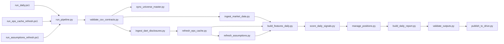
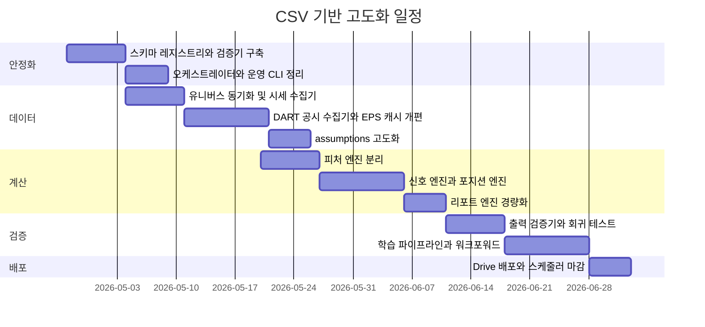
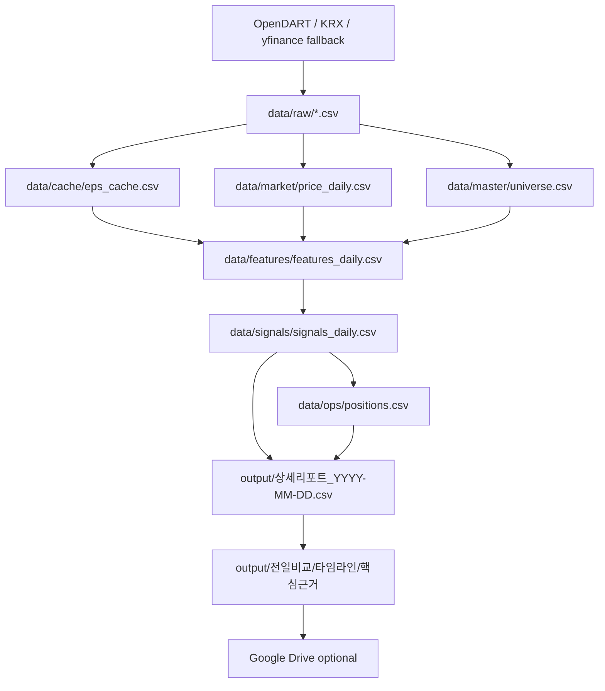

# CSV 기반 주식분석 프로그램 고도화 명세서

## Executive Summary

업로드된 분석 문서를 기준으로 보면, 현재 시스템은 PowerShell이 실행 순서를 제어하고, Python이 EPS·기술지표·점수·레짐을 계산하며, CSV가 사실상 상태 저장소 역할을 하는 일일 배치형 주식 분석 엔진으로 구성되어 있습니다. 일일 운영 경로는 `run_daily.ps1 → preprocess_daily_updates.py → refresh_assumptions.py → build_daily_report.py`이며, 월간 EPS 캐시 갱신과 가정치 보정이 별도 스크립트로 분리되어 있고, 결과물은 로컬 `output`과 옵션 Google Drive 업로드로 마감됩니다. fileciteturn0file0

동시에 보완 문서는 현재 구조가 “종목 선별”, “진입 판단”, “청산 판단”을 충분히 분리하지 못했고, 포인트인타임 정합성, `적자여부`·`sector_group`·`market_regime` 같은 상태 필드의 신뢰도, 그리고 검증·백테스트 체계가 약하다고 진단합니다. 따라서 이번 고도화의 핵심은 기능을 더하는 것보다 먼저 **CSV 계약을 명시하고, 계산 책임을 파일별로 분리하고, 검증기를 상시화하는 것**입니다. fileciteturn0file1

본 보고서의 최종 권고는 다음과 같습니다. 첫째, 현재 구조는 유지하되 `build_daily_report.py`에 몰린 기능을 **피처 생성**, **신호 산출**, **리포트 생성**으로 분리합니다. 둘째, 모든 상태 데이터는 CSV로 유지하되 `schema_registry.csv`를 도입해 스키마를 코드가 아니라 데이터로 통제합니다. 셋째, 데이터 원천은 공시는 entity["organization","금융감독원","korea regulator"] OpenDART, 시세·투자자 흐름·공매도는 entity["organization","한국거래소","seoul exchange korea"] Data Marketplace를 우선으로 두고, 기존 yfinance 경로는 결측 보완용 임시 fallback으로만 남깁니다. OpenDART는 corp code, 공시검색, 원문 파일, XBRL 재무정보를 공식 API로 제공하고, KRX Data Marketplace는 전종목 시세, 투자자별 거래실적, 외국인 보유량, 공매도 통계 등 분석에 필요한 메뉴를 공식적으로 제공합니다. 한편 yfinance는 자체 문서에서 연구·교육 목적의 개인 사용 도구임을 명시하므로 프로덕션 주원천으로 두면 안 됩니다. citeturn6search5turn10search3turn10search8turn8search4turn8search5turn8search6turn7search0

CSV 계층은 pandas의 `read_csv`와 `to_csv`가 제공하는 `dtype`, `parse_dates`, `on_bad_lines`, `chunksize`, `lineterminator`, `date_format`, `compression` 기능을 전제로 설계하는 것이 가장 안전합니다. 이 기능들을 이용하면 컬럼 타입 강제, 불량 행 정책, 날짜 포맷 고정, gzip 아카이브, 대용량 청크 처리까지 모두 코드 수준에서 표준화할 수 있습니다. 또한 1차 AI 자동 개발용 모델 baseline은 scikit-learn의 `Pipeline`, `ColumnTransformer`, `TimeSeriesSplit`, `HistGradientBoostingClassifier` 조합으로 두는 편이 적합합니다. 공식 문서 기준으로 `Pipeline`은 순차 변환기와 최종 예측기를 함께 구성할 수 있고, `ColumnTransformer`는 이질적 칼럼을 분리 처리할 수 있으며, `TimeSeriesSplit`은 시계열 순서를 보존해 train/test를 나누고, `HistGradientBoostingClassifier`는 큰 표형 데이터에서 빠르며 결측치도 네이티브로 처리합니다. citeturn3view0turn4view2turn4view3turn4view4turn5view0turn5view1turn5view2turn5view3turn5view4turn2search0turn2search1turn0search0turn1search0

## 기준 분석과 목표 아키텍처

현재 문서는 이 프로젝트를 “PowerShell이 운영 정책을 관리하고, Python이 계산과 산출물을 만들며, CSV가 상태를 저장하는 운영형 리서치 엔진”으로 설명합니다. 이 정의는 매우 중요합니다. 이유는 이번 작업이 데이터베이스를 새로 도입하는 프로젝트가 아니라, **CSV를 유지하면서도 DB처럼 엄격하게 쓰는 프로젝트**여야 하기 때문입니다. 또한 업로드된 세부분석 문서는 현재 `refresh_daily_preprocess.py`와 `day1_validation.py`를 레거시·보조 경로로 보고 있고, 실사용 검증기는 `day1_validation_fixed.py`라고 정리합니다. 즉, 새 구조는 기존 스크립트를 단순 보존하는 것이 아니라, 실제 운영 경로와 레거시 경로를 분리 정리하는 방향이어야 합니다. fileciteturn0file0

추가 보완 문서는 현재 엔진이 “무엇을 살지”는 어느 정도 말하지만 “언제 살지”와 “언제 팔지”는 충분히 말하지 못한다고 진단합니다. 이 진단은 프로그램 구조에도 그대로 반영되어야 합니다. 구체적으로는 **데이터 수집과 정합성**, **피처 계산**, **신호와 포지션 판단**, **리포트 생성**, **검증과 백테스트**를 분리해야 하며, `build_daily_report.py`는 더 이상 무거운 계산 본체가 아니라 사용자 산출물 생성기로 축소되어야 합니다. fileciteturn0file1



새 아키텍처의 설계 원칙은 다섯 가지로 고정하는 것이 좋습니다. 첫째, **CSV 계약 우선**입니다. 모든 상태 파일은 PK, 날짜 포맷, null 규칙, enum 규칙을 `schema_registry.csv`에 등록하고, 등록되지 않은 컬럼은 만들지 않습니다. 둘째, **원자적 쓰기**입니다. 새 CSV는 반드시 `*.tmp`에 작성한 뒤 검증 후 `os.replace`로 교체합니다. 셋째, **입력과 출력의 언어 분리**입니다. 내부 CSV 컬럼은 영문 `snake_case`, 사용자 보고서만 한글 컬럼을 허용합니다. 넷째, **신호 엔진 2계층**입니다. 1차는 규칙 기반, 2차는 선택적 ML overlay입니다. 다섯째, **실패 가시화**입니다. 예외를 숨기지 말고 `run_history.csv`와 `error_log.csv`에 남겨야 합니다. pandas는 `read_csv`의 `dtype`, `parse_dates`, `on_bad_lines='error'`, `chunksize`, `memory_map`을, `to_csv`의 `lineterminator`, `date_format`, `compression`을 공식 지원하므로, 이 원칙은 라이브러리 기능과도 잘 맞습니다. citeturn5view0turn5view1turn5view2turn5view3turn5view4turn4view2turn4view3turn4view4

데이터 소스 계층도 분명히 나눠야 합니다. OpenDART는 corp code 파일과 공시검색, 원문 파일, XBRL 재무정보를 제공하므로 재무·공시 계층의 1차 소스가 되어야 하고, KRX Data Marketplace는 전종목 시세, 투자자별 거래실적, 외국인 보유량, 공매도 거래와 잔고 등 시세·수급 계층의 1차 소스가 되어야 합니다. 필요 시 발행주식수·권리 관련 데이터는 entity["organization","한국예탁결제원","korea securities depository"] SEIBro를 보조 소스로 붙일 수 있습니다. KRX는 CSV 다운로드 경로도 제공하므로 CSV-first 구조와 상성이 좋습니다. citeturn10search3turn10search8turn6search3turn8search5turn8search6turn9search0

## 실행 우선순위와 프로그램 목록

현재 업로드 문서에는 17개의 운영·분석·검증 스크립트가 존재하지만, 실제 운영 경로는 일부 핵심 파일에 집중되어 있고 일부는 레거시 또는 보조 경로로 남아 있습니다. 따라서 AI 개발 기준의 목표 목록은 “현재 파일을 그대로 늘어놓는 목록”이 아니라 **유지할 것, 분리할 것, 통합할 것, 폐기할 것**을 반영한 미래 상태 목록이어야 합니다. 특히 `refresh_daily_preprocess.py`와 `day1_validation.py`는 더 이상 중심 경로로 가져가면 안 되고, `day1_validation_fixed.py`의 검증 로직은 `validate_outputs.py`로 흡수하는 것이 맞습니다. fileciteturn0file0

| 우선순위 | 목표 프로그램 | 상태 | 기존 대응 | 핵심 목적 | 핵심 CSV |
|---|---|---|---|---|---|
| P0 | `run_pipeline.py` | 신규 | `run_daily.ps1` 하위 Python 실행부 통합 | 일일/월간/수동 파이프라인 오케스트레이션 | `run_history.csv`, `error_log.csv` |
| P0 | `validate_csv_contracts.py` | 신규 | 없음 | 모든 입력·중간·출력 CSV 스키마 검증 | `schema_registry.csv` + 전 CSV |
| P0 | `sync_universe_master.py` | 신규 | 수동 `universe.csv` 관리 보조 | 유니버스 정리 및 자동 갱신 | `universe.csv` |
| P0 | `ingest_market_data.py` | 신규 | `build_daily_report.py` 내부 시세 조회 분리 | 가격·거래량·수급·공매도 정규화 | `price_daily.csv`, `market_index_daily.csv` |
| P0 | `ingest_dart_disclosures.py` | 신규 | `preprocess_daily_updates.py` 일부 분리 | 공시 이벤트·corp code·주식수 변동 수집 | `disclosure_events.csv`, `corp_actions.csv`, `dart_corp_code_cache.csv` |
| P0 | `refresh_eps_cache.py` | 리팩터 | 기존 동명 파일 | EPS 캐시 갱신 및 source priority 명시화 | `eps_cache.csv` |
| P0 | `refresh_assumptions.py` | 리팩터 | 기존 동명 파일 | assumptions 정합성, 섹터 자동채움, 수동값 보존 | `assumptions.csv` |
| P0 | `build_features_daily.py` | 신규 | `build_daily_report.py` 내부 계산부 분리 | 기술·밸류·EPS·레짐 피처 생성 | `features_daily.csv`, `market_regime_history.csv` |
| P0 | `score_daily_signals.py` | 신규 | `build_daily_report.py` 내부 액션 산출부 분리 | base score, entry score, action, risk params 출력 | `signals_daily.csv` |
| P0 | `build_daily_report.py` | 리팩터 | 기존 동명 파일 | 사용자용 리포트와 비교표 생성 전용 | `상세리포트_*.csv`, `핵심근거_*.csv` 등 |
| P0 | `validate_outputs.py` | 신규 | `day1_validation_fixed.py` 흡수 | 최종 산출물 정합성 검사 | `signals_daily.csv`, 리포트 CSV |
| P1 | `manage_positions.py` | 신규 | 없음 | 손절·트레일링·시간종료·비중 관리 | `positions.csv`, `orders.csv` |
| P1 | `train_models.py` | 신규 | 없음 | alpha / entry 모델 학습 및 버전 관리 | `model_registry.csv`, `feature_importance.csv` |
| P1 | `backtest_walkforward.py` | 신규 | 없음 | 시계열 검증과 임계값 튜닝 | `backtest_summary.csv`, `backtest_trades.csv` |
| P1 | `publish_to_drive.py` | 리팩터 | `upload_to_google_drive.py` | 검증 완료 산출물만 업로드 | `publish_history.csv` |
| P2 | `ops_admin.py` | 신규 | 설치·스케줄·환경변수·Drive 체크 스크립트 통합 | 운영 CLI와 기존 PowerShell wrapper 제공 | `up_valuation_config.json`, `run_history.csv` |



## 세부 명세서

아래 명세는 AI가 바로 구현할 수 있도록 프로그램 단위로 **기능**, **입력/출력 포맷**, **CSV 스키마 연결**, **알고리즘/모듈 설계**, **예외 처리**, **성능 목표**, **핵심 테스트**를 한 번에 읽을 수 있게 작성했습니다. 현재 문서가 지적한 핵심 문제, 즉 `build_daily_report.py`의 과도한 책임 집중, 레거시 검증기 혼재, 섹터·손실·레짐 상태 필드의 품질 문제를 직접 해결하도록 구성했습니다. fileciteturn0file0 fileciteturn0file1



### 운영 제어와 배포

| 프로그램 | 기능 | 입력 / 출력 포맷 | 알고리즘·모듈 설계 | 예외 처리 | 성능 목표와 핵심 테스트 |
|---|---|---|---|---|---|
| `run_pipeline.py` | 일일·월간·수동 실행의 단일 진입점. stage 실행, 상태 기록, abort 정책, 재실행 정책 담당 | 입력: `up_valuation_config.json`, 환경변수, `run_history.csv`; 출력: stage별 CSV, `run_history.csv`, `error_log.csv` | `argparse` subcommand(`daily`, `refresh-eps`, `refresh-assumptions`, `backtest`), stage registry 딕셔너리, lock file, `run_id` 생성 | 필수 환경변수 누락·lock 충돌·선행 stage 실패 시 즉시 중단. 단, 비핵심 배포 stage 실패는 보고서만 성공 처리 후 경고 기록 | 800종목 기준 orchestrator 오버헤드 5초 이하. 테스트: lock 충돌, 중간 stage 실패 후 재시작, 동일 `as_of` 재실행 idempotence |
| `ops_admin.py` | 설치, 환경변수 저장, 스케줄 등록·제거, Drive 점검 통합 CLI | 입력: `up_valuation_config.json`, 사용자 입력; 출력: 설정 갱신, `run_history.csv` | `env-set`, `schedule-install`, `schedule-remove`, `check-drive`, `init-config` 서브커맨드. 기존 `.ps1` 파일은 thin wrapper로만 유지 | 민감정보를 파일에 저장하지 않음. 경로 오류·권한 오류 시 사용자 메시지와 `error_log.csv` 기록 | 명령 시작 3초 이내. 테스트: 잘못된 venv 경로, 권한 없는 Task Scheduler, 누락된 service account JSON |
| `validate_csv_contracts.py` | 모든 CSV의 컬럼, PK, dtype, 날짜 포맷, enum, null 규칙 검증 | 입력: `schema_registry.csv` + 대상 CSV; 출력: `schema_validation_report.csv`, `error_log.csv` | registry-driven validator. 각 파일에 `required_cols`, `key_cols`, `date_cols`, `numeric_cols`, `enum_cols` 적용 | 컬럼 누락, 중복 PK, 미래 날짜, enum mismatch, mixed dtype는 fatal. 빈 파일은 파일별 허용 여부로 분기 | 20개 CSV 검증 30초 이하. 테스트: 중복 ticker, 비정상 날짜, 한글 output 컬럼이 core CSV에 섞인 경우 |
| `publish_to_drive.py` | 검증 완료된 산출물만 Drive 업로드 또는 갱신 | 입력: `publish_manifest.csv`, `up_valuation_config.json`, `output/*.csv`; 출력: `publish_history.csv` | create/update 분리, 파일 크기 기준 simple/multipart/resumable 업로드 정책, 동일 파일명 갱신 우선 | 네트워크 실패는 3회 재시도 후 경고. 검증 실패 파일은 업로드 금지 | 20개 파일 업로드 3분 이내. 테스트: 동일 파일 update, 5MB 초과 파일 resumable, 폴더 ID 오류 |

Google Drive API는 공식 문서에서 simple, multipart, resumable 업로드를 구분하며, create/update 패턴을 명확히 제공합니다. 따라서 `publish_to_drive.py`는 파일 크기와 실패 가능성에 따라 업로드 방식을 선택해야 하고, 검증 이전 산출물은 절대 업로드하면 안 됩니다. citeturn6search1turn6search2turn6search7

### 데이터 수집과 정합성

| 프로그램 | 기능 | 입력 / 출력 포맷 | 알고리즘·모듈 설계 | 예외 처리 | 성능 목표와 핵심 테스트 |
|---|---|---|---|---|---|
| `sync_universe_master.py` | 상장 마스터 자동 갱신과 수동 제외 목록 병합 | 입력: 기존 `universe.csv`, optional KRX master raw; 출력: `universe.csv`, `universe_audit.csv` | 자동 수집값과 수동 관리 칼럼(`exclude_flag`, `note`) 분리. 신규 상장 추가, 상장폐지 비활성 처리 | ticker 포맷 불일치, 수동 편집 충돌 시 `universe_audit.csv`에 diff 기록 후 fail-fast | 5천 종목 마스터 동기화 1분 이내. 테스트: 신규상장, 상장폐지, REIT 제외, 수동 blacklist 유지 |
| `ingest_market_data.py` | 가격, 거래량, 지수, 수급, 공매도 일별 수집과 canonical CSV 변환 | 입력: `universe.csv`; 출력: `price_daily.csv`, `market_index_daily.csv`, `source_health.csv` | source adapter 패턴. Primary=`KRX`, Fallback=`yfinance` only if primary miss. 컬럼은 내부 표준으로 정규화 | 휴장일·반장·부분 결측 시 `stale_flag` 기록. 미래일자, 음수 거래량, 중복 PK는 fatal | 800종목 EOD 8분 이하. 테스트: 휴장일, 일부 종목 미수신, KRX 실패 시 fallback, 중복 거래일 |
| `ingest_dart_disclosures.py` | corp code 동기화, 공시 검색, 주식수 변동 및 핵심 이벤트 추출 | 입력: `universe.csv`, `dart_corp_code_cache.csv`, DART key; 출력: `dart_corp_code_cache.csv`, `disclosure_events.csv`, `corp_actions.csv` | corp code cache 우선 후 미존재 종목만 재조회. 공시 이벤트는 `filing_date`, `filing_ts`, `effective_from` 분리 저장 | 인증 실패·호출 제한 시 즉시 중단. corp code 누락 종목은 별도 누락 목록 출력 | 일일 delta 2분, 월간 full sync 10분. 테스트: corp code 신규/변경, 장마감 후 공시의 `effective_from` 이동, 동일 공시 중복 제거 |
| `refresh_eps_cache.py` | EPS 캐시 갱신과 최종 EPS 선택 우선순위 구현 | 입력: `universe.csv`, `assumptions.csv`, `corp_actions.csv`, DART/스크랩 원천; 출력: `eps_cache.csv` | `manual_forward_eps → trailing_eps_dart → consensus_eps_scrape → forward_eps_auto` 우선순위를 유지하되 `forward_eps_final`, `eps_source_rank`, `effective_from`, `refreshed_at`를 명시적으로 생성 | 음수 EPS, split 후 shares mismatch, 소스 결측은 허용하되 source flag 기록. 완전 미존재 종목은 `EPS_MISSING` | 800종목 monthly 20분 이하. 테스트: 주식수 변경 후 rebalance, 수동 EPS override, trailing/consensus 충돌, NaN chain |
| `refresh_assumptions.py` | assumptions를 universe 기준으로 재동기화하고 수동값을 보존 | 입력: `universe.csv`, `assumptions.csv`, `eps_cache.csv`; 출력: `assumptions.csv`, `assumptions_diff.csv` | 신규 종목 기본값 자동 채움. `sector_group`은 blank 또는 `기타`일 때만 auto-fill. 수동 입력 칼럼과 자동 관리 칼럼을 분리 | 수동값 overwrite 금지. universe 미존재 종목은 soft-delete 또는 `inactive` 처리 | 3천 종목 30초 이하. 테스트: 신규 ticker, 삭제된 ticker, 수동 sector 보존, `기타`만 자동 교체 |

OpenDART 공식 개발가이드는 corp code 파일과 공시검색, 원문, 정기보고서 XBRL 재무정보 API를 제공하고, KRX Data Marketplace는 전종목 시세, 투자자별 거래실적, 외국인 보유량, 공매도 거래와 잔고 등의 공식 메뉴를 제공합니다. 이 때문에 데이터 수집기 설계는 “원천별 adapter + canonical CSV 정규화”가 가장 적절합니다. 또한 현재 업로드 문서는 DART 우선 EPS 캐시, corp code cache 재사용, assumptions 섹터 자동 보정, shares rebalance를 핵심 포인트로 보고 있으므로 그 로직을 별도 프로그램에 명시화해야 합니다. citeturn10search3turn10search8turn8search5turn8search6turn8search4 fileciteturn0file0

### 피처, 신호, 포지션, 리포트

| 프로그램 | 기능 | 입력 / 출력 포맷 | 알고리즘·모듈 설계 | 예외 처리 | 성능 목표와 핵심 테스트 |
|---|---|---|---|---|---|
| `build_features_daily.py` | 기술·밸류·EPS·레짐 피처 생성 | 입력: `price_daily.csv`, `eps_cache.csv`, `assumptions.csv`, `market_index_daily.csv`; 출력: `features_daily.csv`, `market_regime_history.csv` | RSI14, MACD histogram, ATR14, ADX14, MA gap, volume ratio, EPS revision, PE, sector-relative z, regime signal 생성. 시장 레짐은 row-level이 아니라 date-level 파일로 분리 | 입력 결측은 feature-level null로 남기고, 필수 가격열 결측은 fatal. 동일 날짜 피처 중복 기록 금지 | 800종목 기준 2분 이하. 테스트: 장기 이평 초기 구간, EPS 결측, sector_group 결측, 레짐 날짜 누락 |
| `score_daily_signals.py` | 종목 선별, 진입 점수, 액션, 초기 손절·목표가 산출 | 입력: `features_daily.csv`, `assumptions.csv`, optional `model_registry.csv`; 출력: `signals_daily.csv` | 1차는 규칙 기반 score, 2차는 optional model overlay. `base_score`, `entry_score`, `action`, `target_weight_pct`, `initial_stop_pct`, `tp1_pct`, `tp2_pct`, `reason_codes` 생성 | EPS 미존재, 레짐 `RISK_OFF`, 유동성 미달, 손실기업 제외는 명시적 rule code로 출력 | 800종목 1분 이하. 테스트: no-signal day, 같은 점수 tie-break, BUY인데 weight=0인 오류, reason code 누락 |
| `manage_positions.py` | 포지션 진입·유지·청산 규칙과 주문 후보 생성 | 입력: `signals_daily.csv`, `positions.csv`, `price_daily.csv`; 출력: `positions.csv`, `orders.csv`, `position_events.csv` | 초기 손절, ATR 기반 트레일링, 시간종료, 가설 붕괴, 모델 반전 규칙 동시 관리. 신규 진입은 max position, sector cap, ADV cap 적용 | 기존 포지션 파일 깨짐, 중복 ticker, 음수 수량은 fatal. 가격 미수신 시 포지션 동결 후 경고 | 200포지션 10초 이하. 테스트: gap-down 손절, partial take-profit, sector cap 초과, same-day re-entry 금지 |
| `build_daily_report.py` | 사용자용 상세리포트·핵심근거·타임라인·전일비교 생성 | 입력: `signals_daily.csv`, `positions.csv`, `features_daily.csv`, `column_dictionary.csv`; 출력: `상세리포트_YYYY-MM-DD.csv`, `종목선정_핵심근거_YYYY-MM-DD.csv`, `최종매수_30일타임라인_YYYY-MM-DD.csv`, `최종매수_전일비교_*.csv` 등 | 계산은 금지하고 formatting만 담당. 내부 영문 컬럼을 `column_dictionary.csv`로 한글 매핑. compact/full 산출물은 manifest 기반 생성 | 출력 폴더 잠금 시 fallback 파일명 사용. 단, 핵심 파일 생성 실패는 fatal | 20개 산출물 2분 이하. 테스트: 전일 파일 부재, 한글 매핑 누락, compact/full 스위치, 빈 signals 결과 |
| `validate_outputs.py` | 최종 액션·비중·레짐·섹터·핵심근거 정합성 검사 | 입력: `signals_daily.csv`, 리포트 CSV, `positions.csv`; 출력: `output_validation_report.csv` | `BUY -> weight>0`, `HOLD/WATCH -> weight=0`, reason code 존재, 리포트 row count 일치, 전일 비교 키 일치 | mismatch는 fail. 경고 가능한 항목과 치명 항목 분리 | 30초 이하. 테스트: action-weight mismatch, Korean output 컬럼 누락, timeline row mismatch, reason text newline 포함 |

현재 문서는 `build_daily_report.py`가 가격 데이터, 기술지표, EPS/밸류 계산, 시장 레짐, 점수, 액션, 비중, compact/full 산출물, 전일 비교, 컬럼사전까지 모두 담당한다고 설명합니다. 이 구조는 운영에는 빠르지만 책임이 과도하게 집중되어 있습니다. 반면 보완 문서는 종목선별, 진입판단, 청산판단을 분리해야 한다고 진단합니다. 따라서 위 테이블처럼 계산과 산출물을 분리하는 것이 가장 큰 리팩터링 포인트입니다. 또한 현재 레거시 검증기 문제를 고려하면 output 검증기는 반드시 별도 파일로 독립해야 합니다. fileciteturn0file0 fileciteturn0file1

### 학습과 백테스트

| 프로그램 | 기능 | 입력 / 출력 포맷 | 알고리즘·모듈 설계 | 예외 처리 | 성능 목표와 핵심 테스트 |
|---|---|---|---|---|---|
| `train_models.py` | alpha 모델과 entry 모델 학습, 버전 관리 | 입력: `features_daily.csv`, `signals_daily.csv`, `backtest_windows.csv`; 출력: `model_registry.csv`, `feature_importance.csv`, optional `artifacts/*.joblib` | subcommand=`alpha`, `entry`. baseline은 `ColumnTransformer + Pipeline + HistGradientBoosting`. `model_registry.csv`에는 모델명, 학습기간, feature set, score, active flag 저장 | feature drift, NaN-only column, leakage candidate 발견 시 학습 중단 | 10년×800종목 일봉 기준 30분 이내. 테스트: 학습/검증 분리, 모델 버전 전환, inactive 모델 fallback |
| `backtest_walkforward.py` | 워크포워드 검증, threshold 탐색, 비용 반영 거래 시뮬레이션 | 입력: `features_daily.csv`, `signals_daily.csv`, `positions.csv`; 출력: `backtest_summary.csv`, `backtest_trades.csv`, `threshold_grid_results.csv` | 날짜 블록 기준 walk-forward. 수수료, 세금, 슬리피지, 거래 불가 조건 반영. signal threshold와 stop parameter를 grid/run basis로 테스트 | 미래 데이터 누수, test 기간 중 train overlap, 공휴일 정렬 오류는 fatal | 20 fold 60분 이내. 테스트: same-day fill leakage, delisted ticker, split-adjust mismatch, empty fold |

scikit-learn 공식 문서를 기준으로 보면 `Pipeline`은 전처리기와 최종 예측기를 한 객체로 묶을 수 있고, `ColumnTransformer`는 서로 다른 칼럼 그룹을 별도 변환한 뒤 결합할 수 있으며, `TimeSeriesSplit`은 시간 순서를 보존한 train/test 분할을 제공합니다. 또한 `HistGradientBoostingClassifier`는 비교적 큰 표형 데이터에서 빠르고 NaN을 직접 다룰 수 있습니다. 따라서 CSV 중심 tabular 구조인 현재 프로젝트에는 외부 ML 프레임워크를 늘리기보다 이 조합을 baseline으로 두는 편이 AI 자동 개발과 운영 안정성에 유리합니다. citeturn2search0turn2search1turn0search0turn1search0

## CSV 스키마와 예제

사용자가 “데이터 관리는 CSV 파일로”를 명확히 요구했기 때문에, 이 프로젝트의 핵심은 단순히 CSV를 쓰는 것이 아니라 **CSV를 계약 기반 저장소처럼 다루는 것**입니다. 이를 위해 모든 상태 파일은 `schema_registry.csv`에 먼저 등록되고, 프로그램은 하드코딩한 컬럼 목록이 아니라 registry를 읽어 검증해야 합니다. pandas는 `read_csv`에서 `dtype`, `parse_dates`, `on_bad_lines`, `low_memory`, `chunksize`, `memory_map`을 지원하고, `to_csv`에서 `lineterminator`, `date_format`, `encoding`, `compression`을 지원하므로, 이 요구사항을 그대로 구현할 수 있습니다. citeturn3view0turn3view2turn5view0turn5view1turn5view2turn5view3turn5view4turn4view2turn4view3turn4view4

### CSV 공통 규칙

| 항목 | 규칙 |
|---|---|
| 인코딩 | `utf-8-sig` |
| 구분자 | `,` |
| 줄바꿈 | `\n` 고정 |
| 날짜 | `YYYY-MM-DD` |
| 시각 | `YYYY-MM-DDTHH:MM:SS+09:00` |
| 내부 컬럼명 | 영문 `snake_case` |
| 사용자 리포트 컬럼명 | 한글 허용. 단, `output/` 하위만 |
| 불리언 | `0/1` |
| enum | `UPPER_SNAKE_CASE` |
| list형 텍스트 | `;` 구분 문자열 |
| PK 중복 | 허용 안 함 |
| 파일 교체 | `tmp` 저장 → 스키마 검증 → `os.replace` |
| 아카이브 | `archive/*.csv.gz` |

### 핵심 CSV 스키마 레지스트리

| 파일명 | PK | 필수 컬럼 | 비고 |
|---|---|---|---|
| `schema_registry.csv` | `file_name` | `file_name,key_cols,required_cols,date_cols,numeric_cols,enum_cols,write_mode` | 전체 스키마의 진실 원천 |
| `universe.csv` | `ticker` | `ticker,name,market,is_active,reit_flag` | 유니버스 마스터 |
| `assumptions.csv` | `ticker` | `ticker,sector_group,is_loss_making_manual,target_pe_bear,target_pe_base,target_pe_bull,manual_forward_eps,max_position_pct` | 수동값 우선 |
| `dart_corp_code_cache.csv` | `ticker` | `ticker,corp_code,updated_at` | DART corp code 캐시 |
| `corp_actions.csv` | `event_id` | `event_id,ticker,event_type,filing_date,filing_ts,effective_from,shares_outstanding_after` | 주식수 변동 및 이벤트 |
| `eps_cache.csv` | `ticker` | `ticker,trailing_eps_dart,trailing_eps_scrape,consensus_eps_scrape,forward_eps_auto,forward_eps_final,source_primary,shares_outstanding,effective_from,refreshed_at` | EPS 원천 및 최종값 |
| `price_daily.csv` | `trade_date+ticker` | `trade_date,ticker,open,high,low,close,adj_close,volume,value_traded,data_source` | 일봉 정규화 파일 |
| `market_index_daily.csv` | `trade_date+index_code` | `trade_date,index_code,close,volume,advance_count,decline_count` | 지수·breadth |
| `features_daily.csv` | `trade_date+ticker` | `trade_date,ticker,rsi14,macd_hist,atr14,adx14,eps_revision_20d,pe_ratio,pe_sector_z,regime_code,feature_version` | 내부 계산용 |
| `signals_daily.csv` | `trade_date+ticker` | `trade_date,ticker,base_score,entry_score,action,target_weight_pct,initial_stop_pct,tp1_pct,tp2_pct,reason_codes,model_version,created_at` | 핵심 운영 신호 |
| `positions.csv` | `as_of_date+ticker` | `as_of_date,ticker,position_status,entry_date,entry_price,current_weight_pct,initial_stop_price,trailing_stop_price,days_held` | 포지션 상태 |
| `orders.csv` | `order_id` | `order_id,trade_date,ticker,side,order_type,target_weight_pct,reason_code,status` | 주문 후보 |
| `run_history.csv` | `run_id` | `run_id,run_type,as_of_date,status,started_at,finished_at,warning_count,error_count,code_version` | 운영 로그 |
| `error_log.csv` | `event_ts+run_id+program_name` | `event_ts,run_id,program_name,severity,error_code,ticker,message` | 에러 로그 |
| `model_registry.csv` | `model_id` | `model_id,model_family,task_type,train_start,train_end,feature_version,score_primary,is_active,artifact_path,created_at` | 모델 메타 |
| `column_dictionary.csv` | `internal_name` | `internal_name,output_ko_name,description,category` | 사용자 리포트 매핑 |

### CSV 입출력 헬퍼 예시

아래 예시는 pandas의 공식 CSV API를 전제로 한 최소 구현 예시입니다. `dtype`, `parse_dates`, `on_bad_lines='error'`, `low_memory=False`로 읽고, `to_csv`에서 인코딩·줄바꿈·날짜포맷을 고정합니다. 큰 파일은 `chunksize`와 `compression='gzip'`로 아카이브하면 됩니다. citeturn5view0turn5view1turn5view2turn5view3turn4view2turn4view3turn4view4

```python
from __future__ import annotations

import os
from pathlib import Path
from typing import Iterable

import pandas as pd


def read_csv_safe(
    path: str | Path,
    *,
    dtype_map: dict[str, str] | None = None,
    parse_dates: list[str] | None = None,
    required_cols: Iterable[str] = (),
) -> pd.DataFrame:
    df = pd.read_csv(
        path,
        dtype=dtype_map,
        parse_dates=parse_dates,
        encoding="utf-8-sig",
        on_bad_lines="error",
        low_memory=False,
    )

    missing = [c for c in required_cols if c not in df.columns]
    if missing:
        raise ValueError(f"필수 컬럼 누락: {missing}")

    # 문자열 컬럼 개행 제거
    for col in df.select_dtypes(include=["object"]).columns:
        df[col] = df[col].astype(str).str.replace("\r", " ", regex=False).str.replace("\n", " ", regex=False)

    return df


def write_csv_atomic(df: pd.DataFrame, path: str | Path) -> None:
    path = Path(path)
    path.parent.mkdir(parents=True, exist_ok=True)

    tmp_path = path.with_suffix(path.suffix + ".tmp")
    df.to_csv(
        tmp_path,
        index=False,
        encoding="utf-8-sig",
        lineterminator="\n",
        date_format="%Y-%m-%d",
    )
    os.replace(tmp_path, path)
```

### 핵심 알고리즘 의사코드

현재 보완 문서가 제시한 방향과 현재 시스템의 EPS 우선순위를 결합하면, 1차 구현의 핵심은 “소스 우선순위가 명시된 EPS 선택”과 “종목 선별과 진입 판단을 분리한 신호 생성”입니다. 현재 문서는 EPS 우선순위를 `manual_forward_eps → trailing_eps_dart → consensus_eps_scrape → forward_eps_auto`로 설명하고 있고, 보완 문서는 종목선별·진입·청산을 분리하라고 요구합니다. 아래 의사코드는 그 두 가지를 합친 형태입니다. fileciteturn0file1

```text
for each ticker on as_of_date:
    # 1) EPS 선택
    if manual_forward_eps is valid:
        forward_eps_final = manual_forward_eps
        source_primary = "MANUAL_FORWARD"
    elif trailing_eps_dart is valid:
        forward_eps_final = trailing_eps_dart
        source_primary = "TRAILING_DART"
    elif consensus_eps_scrape is valid:
        forward_eps_final = consensus_eps_scrape
        source_primary = "CONSENSUS_SCRAPE"
    elif forward_eps_auto is valid:
        forward_eps_final = forward_eps_auto
        source_primary = "FORWARD_AUTO"
    else:
        forward_eps_final = NaN
        source_primary = "EPS_MISSING"

    # 2) base score
    base_score =
          0.30 * value_score
        + 0.25 * momentum_score
        + 0.20 * earnings_revision_score
        + 0.15 * flow_score
        + 0.10 * regime_score

    # 3) entry score
    entry_score =
          0.45 * trigger_score
        + 0.25 * volatility_quality_score
        + 0.20 * liquidity_score
        + 0.10 * news_event_score

    # 4) action
    if regime_code == "RISK_OFF":
        action = "HOLD"
    elif base_score >= 70 and entry_score >= 0.65 and forward_eps_final is valid:
        action = "BUY"
    elif base_score >= 60 and entry_score >= 0.50:
        action = "WATCH"
    else:
        action = "HOLD"

    # 5) risk params
    initial_stop_pct = max(0.035, 2.2 * atr14 / close)
    tp1_pct = max(0.060, 2.5 * atr14 / close)
    tp2_pct = max(0.100, 4.0 * atr14 / close)
```

### 테스트용 CSV 예제

아래 두 파일은 단위 테스트와 통합 테스트의 최소 fixture로 바로 사용할 수 있는 10행 샘플입니다.

`universe.csv`

```csv
ticker,name,market,is_active,reit_flag,sector_code_manual,source_updated_at
005930,삼성전자,KOSPI,1,0,IT,2026-04-25
000660,SK하이닉스,KOSPI,1,0,IT,2026-04-25
035420,NAVER,KOSPI,1,0,인터넷,2026-04-25
051910,LG화학,KOSPI,1,0,화학,2026-04-25
207940,삼성바이오로직스,KOSPI,1,0,바이오,2026-04-25
005380,현대차,KOSPI,1,0,자동차,2026-04-25
068270,셀트리온,KOSPI,1,0,바이오,2026-04-25
105560,KB금융,KOSPI,1,0,금융,2026-04-25
066570,LG전자,KOSPI,1,0,가전,2026-04-25
034730,SK,KOSPI,1,0,지주,2026-04-25
```

`signals_daily_sample.csv`

```csv
trade_date,ticker,base_score,entry_score,action,target_weight_pct,initial_stop_pct,tp1_pct,tp2_pct,reason_codes,model_version,created_at
2026-04-24,005930,72.4,0.71,BUY,2.8,0.045,0.080,0.130,EPS_REV_UP;UPTREND;FLOW_POS,rule_v1,2026-04-24T18:10:00+09:00
2026-04-24,000660,75.1,0.76,BUY,3.2,0.048,0.085,0.140,EPS_REV_UP;BREAKOUT;FLOW_POS,rule_v1,2026-04-24T18:10:00+09:00
2026-04-24,035420,68.5,0.63,WATCH,0.0,0.052,0.075,0.120,GOOD_STOCK;WAIT_PULLBACK,rule_v1,2026-04-24T18:10:00+09:00
2026-04-24,051910,61.2,0.54,HOLD,0.0,0.060,0.070,0.110,RISK_OFF_OVERRIDE,rule_v1,2026-04-24T18:10:00+09:00
2026-04-24,207940,66.4,0.60,WATCH,0.0,0.058,0.072,0.115,GOOD_STOCK;WAIT_EVENT,rule_v1,2026-04-24T18:10:00+09:00
2026-04-24,005380,70.0,0.67,BUY,2.4,0.047,0.082,0.132,VALUE_OK;UPTREND;FLOW_POS,rule_v1,2026-04-24T18:10:00+09:00
2026-04-24,068270,58.3,0.49,HOLD,0.0,0.062,0.068,0.108,NO_TRIGGER,rule_v1,2026-04-24T18:10:00+09:00
2026-04-24,105560,63.7,0.55,WATCH,0.0,0.055,0.071,0.112,VALUE_OK;WAIT_CONFIRM,rule_v1,2026-04-24T18:10:00+09:00
2026-04-24,066570,59.1,0.51,HOLD,0.0,0.059,0.069,0.109,NO_TRIGGER,rule_v1,2026-04-24T18:10:00+09:00
2026-04-24,034730,64.0,0.58,WATCH,0.0,0.054,0.073,0.118,GOOD_STOCK;WAIT_PULLBACK,rule_v1,2026-04-24T18:10:00+09:00
```

## AI 개발 지침과 검증 기준

Python 공식 문서에 따르면 가상환경은 반드시 “활성화”할 필요가 없고, 가상환경의 Python 실행파일 전체 경로를 직접 호출해도 됩니다. 또한 환경을 다른 경로로 옮길 때는 재생성하는 것이 권장되며, `requirements.txt`를 이용해 필요한 패키지를 다시 설치하는 방식을 제시합니다. 이 점은 현재 PowerShell + Task Scheduler 구조와 매우 잘 맞습니다. 따라서 기존 `run_daily.ps1` 계열 wrapper는 유지하되, 실제 실행기는 항상 `.venv\Scripts\python.exe`의 전체 경로를 호출하도록 고정하는 것이 가장 안정적입니다. citeturn4view0turn4view1

현재 업로드 문서는 이미 `DART_API_KEY`, `KRX_ID`, `KRX_PW`, `UP_VALUATION_PYTHON` 같은 환경변수와 자동화 설치·스케줄 관리 스크립트를 갖고 있습니다. 새 구조에서는 이들을 흩어진 `.ps1`의 개별 책임으로 두기보다 `ops_admin.py`가 통합하고, 기존 `.ps1`은 운영자 편의를 위한 얇은 래퍼로만 남기는 편이 좋습니다. 이 방식이면 현재 운영 경험을 보존하면서도 AI가 개발할 핵심 코드의 난이도를 크게 낮출 수 있습니다. fileciteturn0file0

### 개발 기준

| 구분 | 기준 |
|---|---|
| 언어 | Python 3.11 권장, PowerShell은 wrapper만 유지 |
| 핵심 라이브러리 | pandas, numpy, scikit-learn, requests |
| 선택 라이브러리 | pyarrow, tenacity, joblib, pytest, ruff, mypy |
| 내부 데이터 저장 | CSV만 사용 |
| 모델 메타데이터 | `model_registry.csv`, `feature_importance.csv`, `threshold_grid_results.csv` |
| 모델 아티팩트 | 1차는 규칙 기반으로 무아티팩트 가능, 2차부터 optional `.joblib` 허용 |
| 폴더 구조 | `data/master`, `data/manual`, `data/cache`, `data/raw`, `data/features`, `data/signals`, `data/ops`, `output`, `archive`, `artifacts`, `tests` |
| 네이밍 규칙 | 내부: 영문 `snake_case`; 사용자 산출물: 한글 파일명 허용 |
| 로깅 규칙 | 모든 실행은 `run_history.csv`와 `error_log.csv`를 남김 |
| 스키마 변경 규칙 | 반드시 `schema_registry.csv`와 `column_dictionary.csv`를 동시에 수정 |
| 배포 규칙 | 검증 실패 상태에서는 Drive 업로드 금지 |

### 배포 절차

| 단계 | 내용 |
|---|---|
| 환경 생성 | `py -3.11 -m venv .venv` |
| 패키지 설치 | `.venv\Scripts\python.exe -m pip install -r requirements.txt` |
| 초기 설정 | `.venv\Scripts\python.exe ops_admin.py init-config` |
| 환경변수 등록 | `.venv\Scripts\python.exe ops_admin.py env-set --dart-key ...` |
| 스키마 검증 | `.venv\Scripts\python.exe validate_csv_contracts.py --all` |
| 일일 실행 | `.venv\Scripts\python.exe run_pipeline.py daily --as-of YYYY-MM-DD` |
| 월간 EPS | `.venv\Scripts\python.exe run_pipeline.py refresh-eps --as-of YYYY-MM-DD` |
| 백테스트 | `.venv\Scripts\python.exe backtest_walkforward.py --start 2018-01-01 --end 2026-04-24` |
| 스케줄 등록 | `run_daily.ps1` 등 wrapper를 Task Scheduler에 연결 |
| 선택 배포 | `.venv\Scripts\python.exe publish_to_drive.py --as-of YYYY-MM-DD` |

### AI 구현 프롬프트

```text
당신은 CSV 기반 주식분석 시스템의 구현 AI다.

[프로젝트 목표]
- 기존 PowerShell + Python + CSV 구조를 유지하면서
- 계산 책임을 모듈별로 분리하고
- 모든 상태 데이터는 CSV로 관리하며
- 종목선별 / 진입판단 / 청산판단 / 리포트생성을 분리 구현한다.

[절대 규칙]
1. 상태 데이터는 CSV만 사용한다.
2. 내부 CSV 컬럼명은 영문 snake_case만 사용한다.
3. 사용자용 output 파일만 한글 컬럼명을 허용한다.
4. 신규 컬럼을 만들기 전에 schema_registry.csv와 column_dictionary.csv를 먼저 수정한다.
5. 모든 CSV 쓰기는 tmp 파일에 저장 후 검증 후 os.replace로 교체한다.
6. 예외를 숨기지 말고 error_log.csv와 run_history.csv에 남긴다.
7. 외부 API 응답은 즉시 canonical CSV로 정규화한다.
8. 레거시 파일 refresh_daily_preprocess.py와 day1_validation.py는 재생성하지 않는다.
9. build_daily_report.py에는 무거운 계산 로직을 넣지 않는다.
10. 테스트를 먼저 만들고 구현한다.

[구현 순서]
- validate_csv_contracts.py
- run_pipeline.py
- sync_universe_master.py
- ingest_market_data.py
- ingest_dart_disclosures.py
- refresh_eps_cache.py
- refresh_assumptions.py
- build_features_daily.py
- score_daily_signals.py
- manage_positions.py
- build_daily_report.py
- validate_outputs.py
- train_models.py
- backtest_walkforward.py
- publish_to_drive.py
- ops_admin.py

[완료 기준]
- daily 파이프라인이 동일 입력에서 두 번 실행되어도 동일한 CSV를 생성한다.
- BUY action은 항상 target_weight_pct > 0 이다.
- HOLD/WATCH action은 항상 target_weight_pct = 0 이다.
- signals_daily.csv와 상세리포트의 ticker 수와 action 분포가 일치한다.
- 검증 실패 상태에서는 publish_to_drive.py가 동작하지 않는다.
```

### 모델 구현 기준

시계열 기준 모델은 scikit-learn의 composite estimator 패턴을 그대로 따르는 것이 좋습니다. `Pipeline`은 전처리와 예측기를 같이 관리할 수 있고, `ColumnTransformer`는 수치·범주형 칼럼을 분리 처리할 수 있으며, `TimeSeriesSplit`은 시간 순서를 지키는 검증을 제공합니다. 또한 `HistGradientBoostingClassifier`는 결측치가 있는 표형 데이터에 강하고, 비교적 큰 샘플에서 빠르게 동작합니다. 따라서 `train_models.py`의 baseline은 이 조합으로 고정하는 것이 AI 구현 난이도와 운영 안정성 모두에 유리합니다. citeturn2search0turn2search1turn0search0turn1search0

```python
from sklearn.compose import ColumnTransformer
from sklearn.pipeline import Pipeline
from sklearn.model_selection import TimeSeriesSplit
from sklearn.ensemble import HistGradientBoostingClassifier
from sklearn.impute import SimpleImputer
from sklearn.preprocessing import OneHotEncoder

num_cols = ["rsi14", "macd_hist", "atr14", "eps_revision_20d", "pe_ratio", "pe_sector_z"]
cat_cols = ["sector_group", "regime_code"]

preprocessor = ColumnTransformer(
    transformers=[
        ("num", SimpleImputer(strategy="median"), num_cols),
        ("cat", Pipeline([
            ("impute", SimpleImputer(strategy="most_frequent")),
            ("onehot", OneHotEncoder(handle_unknown="ignore"))
        ]), cat_cols),
    ],
    remainder="drop",
)

model = HistGradientBoostingClassifier(
    learning_rate=0.05,
    max_depth=6,
    max_iter=300,
    random_state=42
)

pipe = Pipeline([
    ("prep", preprocessor),
    ("model", model),
])

tscv = TimeSeriesSplit(n_splits=5, test_size=60, gap=5)
```

### 검증 게이트

| 검증 항목 | 통과 기준 |
|---|---|
| 스키마 검증 | 필수 CSV 100% 통과 |
| 일일 실행 시간 | 800종목 기준 15분 이내 |
| 월간 EPS 갱신 | 45분 이내 |
| 재실행 일관성 | 동일 `as_of` 재실행 시 핵심 CSV row count와 checksum 동일 |
| action-weight 정합성 | 오류 0건 |
| report-signal 일치 | ticker/action 수 100% 일치 |
| stale source 감지 | 미수신 소스가 있으면 반드시 `source_health.csv`와 `error_log.csv`에 기록 |
| 백테스트 누수 방지 | same-day fill leakage 0건, test 기간 overlap 0건 |
| 업로드 안전성 | 검증 실패 파일 업로드 0건 |

이상과 같이 구현하면, 현재 시스템의 장점인 **운영 자동화와 CSV 친화성**은 그대로 살리면서, 보완 문서가 요구한 **정합성 강화, 기능 분리, 검증 상시화, AI 친화적 명세화**를 동시에 달성할 수 있습니다. 핵심은 “CSV만 쓰는 것”이 아니라 “CSV를 스키마 계약과 원자적 쓰기, 검증기, 버전 로그로 통제하는 것”입니다. 그렇게 해야 AI가 컬럼명, 파일 책임, 우선순위, 예외 처리를 오해하지 않고 정확하게 자동 개발할 수 있습니다. fileciteturn0file0 fileciteturn0file1