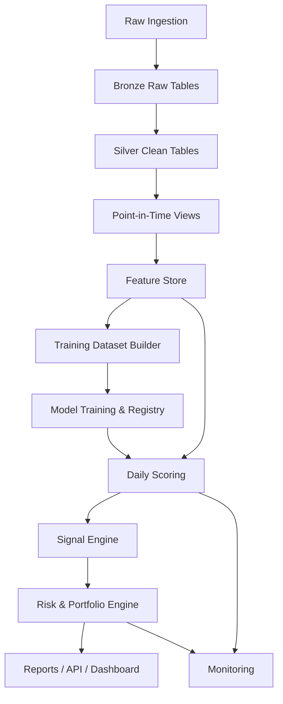
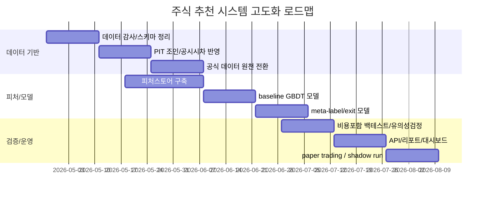

# 주식 추천 시스템 고도화 개발지시서

## 요약

업로드한 매뉴얼을 기준으로 현재 시스템은 일일 전처리와 EPS 캐시 갱신을 분리한 배치 구조를 가지고 있고, EPS 우선순위를 `manual_forward_eps → trailing_eps_dart → consensus_eps_scrape → forward_eps_auto`로 두며, 기술점수는 추세·RSI·MACD·거래량·20일 돌파를 합성하고, 최종매수후보는 총점·200일선 상회·20일 돌파·EPS 존재 여부를 동시에 만족하는 규칙형 구조로 운영되고 있습니다. 일일 산출물로 상세리포트, 관심종목요약, 진입후보요약, 30일 타임라인, 전일 비교표까지 자동 생성하도록 정리되어 있어 운영 자동화 수준은 이미 꽤 높습니다. fileciteturn0file0

다만 업로드된 CSV를 직접 집계해 보면, 현재 구조는 **종목 선별**과 **매수 타이밍**과 **매도 타이밍**이 아직 분리되어 있지 않습니다. 779개 종목 중 최종매수후보는 17개, 진입대기는 65개인데, EPS 소스는 사실상 `TRAILING_DART`가 대부분이고, 섹터그룹은 전 종목이 `기타`, 섹터 PER 상한도 단일 상수로 들어가 있습니다. 또한 후행 EPS가 음수인 종목이 203개인데 `적자여부` 플래그는 0으로만 채워져 있었고, 핵심근거 파일 57건 중 46건은 선택신호가 `해당없음`이었습니다. 즉, 현재 시스템은 “좋아 보이는 종목을 고르는 엔진”으로는 시작점이 있지만, **진짜로 언제 사야 하는지**, **언제 팔아야 하는지**, **왜 그 시점이 통계적으로 유리한지**를 설명하는 엔진은 아직 비어 있습니다.

이 개발지시서의 핵심 권고는 다섯 가지입니다. 첫째, **포인트인타임 데이터 정합성**을 먼저 고칩니다. 둘째, EPS·PER 중심 구조를 **재무·기술·수급·거시·뉴스/검색 트렌드**까지 확장합니다. 셋째, 모델을 “좋은 종목 선별”과 “지금 들어가도 되는지 판단”으로 분리하는 **2단 엔진**으로 바꿉니다. 넷째, 매도는 단순 이익실현이 아니라 **손절·트레일링·시간종료·가설붕괴·모델 반전**의 다중 출구 구조로 설계합니다. 다섯째, 백테스트는 단순 과거수익률 비교가 아니라 **walk-forward + purged CV/CPCV + 거래비용 + White RC/SPA + DSR**까지 포함한 연구 체계로 바꿉니다. 금융 데이터 원천은 국내에서는 entity["organization","금융감독원","korea regulator"] OpenDART, entity["organization","한국거래소","seoul exchange korea"] Data Marketplace/OpenAPI, entity["organization","한국예탁결제원","securities depository korea"] SEIBro, entity["organization","한국은행","south korea central bank"] ECOS, entity["organization","통계청","south korea statistics"] KOSIS, entity["company","NAVER","korea portal company"] DataLab/Search API, entity["organization","한국언론진흥재단","korea press foundation"] BigKinds를 1순위로 두는 것이 적절합니다. citeturn1search12turn1search4turn1search1turn10search4turn17search5turn17search2turn20search1turn21search2turn1search3turn11search0turn19search0turn11search6

현재 yfinance는 개발 편의성은 좋지만, 공식 문서 자체가 Yahoo와 무관한 오픈소스 도구이며 연구·교육 목적, 개인적 사용 중심이라는 점을 명시하고 있습니다. 따라서 운영 프로덕션에서는 yfinance를 주 원천으로 두면 안 되고, **개발용 fallback** 또는 **결측 보완용 비권장 보조원천**으로만 남겨야 합니다. citeturn15search1turn15search3

### 우선순위 권고

| 우선순위 | 작업 | 이유 | 완료 기준 |
|---|---|---|---|
| P0 | `적자여부`, `섹터그룹`, `섹터PER상한`, `마켓레짐` 정합성 수정 | 현재 점수/리스크 플래그가 잘못 작동하거나 비활성 상태 | 일일 리포트에서 손실플래그·섹터맵·레짐 분포가 정상 출력 |
| P0 | 포인트인타임 조인 계층 도입 | 공시시점/발표시점 누락은 치명적 누수(leakage) 원인 | 동일 백테스트 재현 시 run_id와 data_snapshot_id 일치 |
| P1 | 재무·수급·거시·뉴스/검색 피처 추가 | EPS+기술지표만으로는 정보량 부족 | 신규 피처셋으로 baseline 대비 Precision@K 및 Sharpe 개선 |
| P1 | `Base Alpha + Meta Label + Exit Engine` 구조 도입 | 종목선별과 타이밍을 분리해야 정확도 개선 가능 | 진입 확률, 기대수익, 기대낙폭, 매도계획이 모두 출력 |
| P1 | 거래비용 포함 walk-forward / CPCV 백테스트 | 과최적화와 데이터 스누핑 방지 | DSR 양수, SPA 또는 RC에서 baseline 대비 유의성 확보 |
| P2 | 피처 스토어, 모델 레지스트리, 모니터링 구축 | 운영 안정성과 설명가능성 확보 | 데이터 freshness, drift, slippage, live-vs-backtest 차이 모니터링 |

## 현재 시스템 진단

현재 시스템의 장점은 분명합니다. 운영 구조가 이미 배치 중심으로 정리되어 있고, DART 공시 반영, EPS 캐시, 결과 CSV 자동출력, 스케줄러 운영, 품질점검 체크리스트까지 매뉴얼에 체계적으로 기록되어 있습니다. 즉, “아이디어 수준의 스크립트”가 아니라 “실행되는 운영 시스템”의 뼈대는 이미 갖추고 있습니다. 이 점은 고도화의 출발점으로 매우 좋습니다. fileciteturn0file0

현재 문제는 **알고리즘 품질보다 먼저 데이터와 상태표현이 단순하다**는 점입니다. 매뉴얼상 기술점수는 연속형이지만, 액션은 결국 몇 개의 hard filter로 결정됩니다. 그리고 산출물 구조상 현재는 “좋은 종목 + 20일 돌파 + 200일선 상단”이 매수후보의 본질이기 때문에, **추세형 장세에서는 늦고**, **눌림목에서는 기회를 놓치며**, **이벤트성 리레이팅에서는 반응이 늦을 가능성**이 큽니다. fileciteturn0file0

다음 표는 업로드된 산출물 CSV를 직접 집계한 결과입니다.

| 영역 | 업로드 분석 결과 | 시사점 |
|---|---|---|
| 유니버스/액션 | 779개 중 최종매수후보 17, 진입대기 65, 관찰 84, 제외 613 | 후보는 나오지만 로직이 컷오프 중심이라 타이밍 정밀도가 낮음 |
| EPS 구조 | EPS 소스: TRAILING_DART 761, FORWARD_AUTO 12, CONSENSUS_SCRAPE 6 | 실질적으로 후행 EPS 엔진 |
| 적자 플래그 | 후행 EPS 음수 203개인데 `적자여부=1`은 0 | 리스크 제어 신호 결함 가능성 |
| 섹터 처리 | 섹터그룹 고유값 1개, 전부 `기타` | 섹터 상대가치 비교가 비활성 |
| 밸류 점수 | 밸류점수 5점 바닥 비중 64.7% | 밸류 스코어 분해능 부족 |
| 마켓 레짐 | 전 종목 `BULL`, 레짐 비중배수 1.0 | 레짐 필터가 사실상 비작동 |
| 진입 신호 | 핵심근거 57건 중 `선택신호=해당없음` 46건 | 엔트리 트리거 엔진이 약함 |
| 신호 기대값 | `돌파+거래량+RSI안전` 신호의 내장 5일 기대값 평균 -2.06% | 기존 매수 트리거 중 일부는 재검증 필요 |
| 전일 비교 | 최종매수후보 17개 모두 전일 대비 유지 | 반응속도보다 관성에 치우칠 수 있음 |

가장 중요한 진단은 이것입니다. **현재 시스템은 "무엇을 살지"는 어느 정도 말하지만, "언제 살지"와 "언제 팔지"는 아직 말하지 못합니다.** 그래서 아키텍처를 반드시 세 계층으로 나눠야 합니다.  
첫째, **종목선별**: 앞으로 10~20거래일 기대수익이 높은 종목을 고릅니다.  
둘째, **진입판단**: 오늘/다음 바에서 들어갈 확률과 비용 대비 기대값이 좋은가를 평가합니다.  
셋째, **청산판단**: 손절·익절·추세붕괴·시간종료를 분리해 관리합니다.  

이 구조로 바꾸면 현재 시스템의 강점인 일일 운영 자동화는 그대로 활용하면서, 약점인 엔트리/엑시트 정밀도를 크게 높일 수 있습니다.

## 데이터와 피처 명세

### 데이터 원천 우선순위

국내 주식 추천 시스템에서 프로덕션 기준 데이터 우선순위는 다음처럼 정하는 것이 맞습니다. 공시·재무는 OpenDART, 시세·투자자별 흐름·공매도·일중/호가/체결은 KRX Data Marketplace, 주식수·배당·권리·발행주식 변동은 SEIBro, 거시는 ECOS·KOSIS, 뉴스와 검색 트렌드는 NAVER API와 BigKinds를 쓰는 것이 가장 합리적입니다. KRX는 일중 매매정보·호가장·체결장·공매도 순보유잔고까지 상품군을 제공하고, KRX OpenAPI 문서는 실시간/지연시세의 재배포·수익사업 활용에는 별도 계약이 필요하다고 명시합니다. SEIBro 역시 API 활용신청·운영계정 심사를 두고 있고 일부 활용 제한 가능성을 안내합니다. 이런 이유로 “개발 편의성”보다 “공식성·라이선스·지연/실시간 구분”을 먼저 설계해야 합니다. citeturn1search12turn1search4turn1search1turn10search4turn10search10turn17search0turn17search2turn17search5turn17search8turn20search1turn21search2turn11search0turn1search3turn19search0turn11search6

사용자가 데이터 주기를 명시하지 않았으므로, 이 문서는 세 가지 운영 모드를 제안합니다. **기본 모드**는 일봉 EOD, **정밀 모드**는 30분봉, **고빈도 모드**는 1분/호가입니다. 현재 업로드된 구조와 운영 부담을 고려하면 1차 구축은 **일봉 중심 + 선택적 30분봉 타이밍 모듈**이 가장 현실적이고, 호가 기반 모델은 KRX/Koscom 계약과 인프라가 확보된 이후에만 진행하는 것이 맞습니다. citeturn10search4turn10search10

| 범주 | 1순위 원천 | 권장 주기 | 용도 | 비고 |
|---|---|---|---|---|
| 재무제표/공시 | OpenDART | filing event / 일별 반영 | EPS, 매출, 영업이익, 자본, 부채, 공시 이벤트 | 포인트인타임 필수 |
| 상장종목 마스터 | KRX 상장종목정보 | 일 1회 | universe, ticker, ISIN, 시장구분 | 기준일자+1 영업일 업데이트 감안 |
| 일봉 시세/거래량 | KRX Data Marketplace | 일별 | OHLCV, 수익률, 변동성 | yfinance 대체 |
| 투자자별 수급 | KRX Data Marketplace | 일별/일중 | 외국인·기관·개인 순매수 | 핵심 수급 피처 |
| 공매도/잔고 | KRX Data Marketplace | 일별 | short pressure, crowding | 매도 리스크와 squeeze 탐지 |
| 호가/체결 | KRX Data Marketplace / OpenAPI | 분/틱 | order book imbalance, execution quality | 라이선스·비용 검토 필요 |
| 주식수/배당/권리 | SEIBro | event / 일별 | 발행주식변동, 배당, 잠재주식, 권리일정 | EPS 보정·희석 반영 |
| 거시 | ECOS, KOSIS | 일/주/월 | 금리, 환율, 경기·물가, 산업지표 | 발표시차 반영 필수 |
| 뉴스 | NAVER Search API, BigKinds | 일/시간 | 뉴스량·감성·이슈 | 제목·본문 임베딩 분리 |
| 검색 트렌드 | NAVER DataLab | 일/주 | 관심도 급증, 테마화 | 종목·산업 키워드 사전 관리 |
| 보조/개발용 | yfinance | 개발용 | 로컬 테스트 fallback | 프로덕션 주원천 금지 |

해외 확장까지 고려한다면, 영문 공식 원천으로는 entity["organization","미국 증권거래위원회","us securities regulator"] EDGAR와 entity["organization","세인트루이스 연방준비은행","fred provider"] FRED를 보조 계층에 붙이면 됩니다. EDGAR는 전자공시 텍스트 검색과 최신 제출 공시를, FRED는 세계·미국 매크로 시계열을 공식적으로 제공합니다. citeturn22search5turn22search2

### 포인트인타임 데이터 원칙

이 시스템에서 가장 먼저 강제해야 하는 규칙은 **“모든 피처는 그 시점에 투자자가 실제로 알 수 있었던 정보로만 구성한다”**는 것입니다. 예를 들어 분기보고서 수치는 공시 접수 시간이 장 마감 후라면 당일 시그널에 쓰면 안 되고, 다음 거래일부터 효력을 갖도록 `effective_from`을 밀어야 합니다. 거시지표도 통계기간이 아니라 **공표일**을 기준으로 붙여야 하고, 뉴스 감성은 기사 게시시각과 수집시각을 분리해야 합니다. OpenDART와 ECOS/KOSIS가 공식 원천이라는 사실보다 더 중요한 것은, 이 원천을 **발표시차를 보존한 상태로 저장**하는 것입니다. citeturn1search12turn20search1turn21search2

### 우선 추가해야 할 피처

아래 표는 “반드시”, “권장”, “확장”의 세 단계로 정리한 피처 백로그입니다.

| 우선순위 | 범주 | 피처 | 정의/공식 | 주기 | 이유 |
|---|---|---|---|---|---|
| 반드시 | 재무 | TTM EPS 성장률 | \((EPS_{TTM,t} - EPS_{TTM,t-252}) / |EPS_{TTM,t-252}|\) | 일별 갱신 | EPS 수준만 보지 말고 방향까지 반영 |
| 반드시 | 재무 | Forward EPS revision | \((fwdEPS_t - fwdEPS_{t-20}) / |fwdEPS_{t-20}|\) | 일별 | 리레이팅 탐지 |
| 반드시 | 재무 | ROE / ROIC | \(ROE=NI/AvgEquity,\; ROIC=NOPAT/InvestedCapital\) | filing | 싼 종목과 좋은 종목 분리 |
| 반드시 | 재무 | FCF Yield | \(FCF/EV,\; FCF=CFO-CapEx\) | filing | 현금창출력 검증 |
| 반드시 | 재무 | Accrual Ratio | \((NI-CFO)/AvgAssets\) | filing | 질 낮은 이익 필터 |
| 반드시 | 가치 | EV/EBITDA | \(EV / EBITDA\) | filing | PER 편향 보완 |
| 반드시 | 가치 | Sector-relative z-score | 섹터 내 표준화 점수 | 일별 | 섹터 왜곡 제거 |
| 반드시 | 기술 | ATR14 | 평균 진폭 | 일별/30분 | 변동성 기반 손절·익절 |
| 반드시 | 기술 | ADX14 | 추세 강도 | 일별/30분 | 돌파와 박스권 구분 |
| 반드시 | 기술 | Bollinger bandwidth | \((Upper-Lower)/MA\) | 일별/30분 | 수축→확장 시그널 |
| 반드시 | 기술 | OBV / MFI | 거래량 누적·자금흐름 | 일별/30분 | 거래량의 질 개선 |
| 반드시 | 수급 | 외국인·기관 순매수 비율 | \(NetBuy / ADV20\) | 일별/30분 | 후행 가격보다 먼저 주는 정보 |
| 반드시 | 수급 | 공매도 잔고 변화 | \(\Delta ShortBalance\) | 일별 | crowding / squeeze |
| 반드시 | 유동성 | ADV20, turnover, spread proxy | 거래대금·회전율·스프레드 추정 | 일별/분 | 체결 가능성·슬리피지 추정 |
| 권장 | 이벤트 | 실적발표 D-1/D+1, 공시 유형 | filing category dummy | event | 이벤트 전후 행동 분리 |
| 권장 | 대안 | 뉴스 감성, 기사량, 주제 분포 | FinBERT/KoBERT 임베딩 | 일/시간 | 테마/심리 반영 |
| 권장 | 대안 | 검색 트렌드 급등 | DataLab z-score | 일/주 | 리테일 관심 급등 포착 |
| 권장 | 거시 | 금리, 환율, 신용스프레드, 유가 | 표준화된 macro state | 일/주/월 | 전 장세 공통 압력 |
| 권장 | 마이크로 | Order Book Imbalance | \((\Sigma bid - \Sigma ask)/(\Sigma bid+\Sigma ask)\) | 분/틱 | 엔트리 정밀도 향상 |
| 확장 | 품질 | Piotroski F-score | 9개 binary quality 합계 | filing | 저PER 함정 방지 |
| 확장 | 리스크 | 베타, idio-vol, downside semivol | 회귀/표준편차 기반 | 일별 | 종목별 리스크 조절 |
| 확장 | NLP | 공시 텍스트/뉴스 텍스트 임베딩 | sentence encoder | event | 이벤트 의미 파악 |
| 확장 | 시장미시 | VPIN, OFI | 주문흐름 불균형 | 틱 | 고빈도 진입·청산 최적화 |

핵심 추가 공식은 아래처럼 정의하면 됩니다.

```text
RSI14 = 100 - 100 / (1 + RS),  RS = EMA(Gain,14) / EMA(Loss,14)

MACD = EMA(Close,12) - EMA(Close,26)
MACD_hist = MACD - EMA(MACD,9)

ATR14 = EMA(TrueRange,14)
TrueRange = max(High-Low, |High-Close_prev|, |Low-Close_prev|)

OBV_t = OBV_{t-1} + sign(C_t - C_{t-1}) * Volume_t

EarningsRevision20 = (ForwardEPS_t - ForwardEPS_{t-20}) / max(|ForwardEPS_{t-20}|, eps)

OrderBookImbalance_k
= (sum(BidSize_1:k) - sum(AskSize_1:k)) / (sum(BidSize_1:k) + sum(AskSize_1:k))

NetFlowRatio = (ForeignNetBuy + InstNetBuy) / ADV20
```

## 신호 엔진과 모델 설계

### 목표 구조

권장 구조는 아래처럼 **종목선별 → 진입판단 → 리스크오버레이 → 매도엔진**의 다층 구조입니다. 현재처럼 총점 하나로 “좋은 종목”과 “지금 들어갈 타이밍”을 동시에 판단하면 정확도가 떨어지기 쉽습니다.


### 권장 매수 엔진

매수는 “셋업 점수”와 “트리거 점수”를 분리해야 합니다.

**셋업(set-up)** 은 앞으로 10~20거래일 기대수익이 높은 종목인지 평가합니다.  
**트리거(trigger)** 는 오늘 또는 다음 바에서 실제 진입해도 통계적으로 유리한지 평가합니다.

권장 수식은 다음과 같습니다.

\[
\text{EntryScore}_{i,t}
=
0.40 \hat p^{TB+}_{i,t,10}
+
0.25 z(\hat\mu^{10}_{i,t})
+
0.15 z(\hat\mu^{20}_{i,t})
+
0.10 \hat q^{meta}_{i,t}
-
0.10 z(\hat c_{i,t})
\]

여기서

- \(\hat p^{TB+}_{i,t,10}\): 10일 triple-barrier 상단 도달 확률
- \(\hat\mu^{10}_{i,t}\): 10일 기대수익률
- \(\hat\mu^{20}_{i,t}\): 20일 기대수익률
- \(\hat q^{meta}_{i,t}\): “지금 진입해도 되는가”를 맞히는 메타라벨 확률
- \(\hat c_{i,t}\): 수수료 + 세금 + 슬리피지 + 스프레드 비용 추정

실전 조건은 다음처럼 두는 것을 권장합니다.

```text
BUY if
    RegimeGate = 1
and BaseAlphaRank <= 50
and EntryScore >= θ_buy
and ExpectedReturn10d >= 1.8 * ExpectedCost
and ExpectedMaxDrawdown10d <= DD_limit
and ADV20 participation <= 5%
```

여기서 `RegimeGate`는 단순히 BULL/BEAR 이진값이 아니라 다음 최소 3상태가 바람직합니다.

- `RISK_ON`
- `NEUTRAL`
- `RISK_OFF`

레짐은 아래 피처로 별도 모델 또는 규칙 기반으로 계산합니다.

- KOSPI/KOSDAQ index trend
- 시장 breadth
- 변동성 지표
- 원/달러
- 금리와 신용스프레드
- 외국인 수급

### 권장 매수 플레이북

현 시스템은 사실상 **추세 돌파형**만 강합니다. 여기에 최소 두 가지를 더 붙여야 합니다.

| 플레이북 | 조건 | 장점 | 주의점 |
|---|---|---|---|
| 돌파 지속형 | 20일/55일 고점 돌파 + ADX 상승 + 거래량 확장 | 강한 모멘텀 포착 | 가짜 돌파 많음 |
| 상승추세 눌림형 | 200일선·60일선 위 + EMA20/ATR 되돌림 후 재상승 | 늦지 않게 매수 가능 | 박스권이면 실패 증가 |
| 실적 리레이팅형 | EPS revision 양수 + 공시/뉴스 이벤트 후 가격 재평가 | 펀더멘털 변화 반영 | 이벤트 leakage 주의 |

업로드된 핵심근거 파일에서 `선택신호=해당없음`이 과반인 점을 보면, **돌파 신호가 없을 때 사용할 두 번째 진입 규칙**, 즉 “상승추세 눌림형”이 반드시 추가되어야 합니다. 이것이 없으면 시스템은 좋은 종목을 찾고도 진입을 놓칩니다.

### 권장 매도 엔진

매도는 “하나의 규칙”이 아니라 다음 다섯 가지 출구를 동시에 관리해야 합니다.

**안전 출구**
- 초기 손절
- 트레일링 손절

**알파 출구**
- 기대수익 달성 후 부분익절
- 모델 반전

**관리 출구**
- 시간 종료
- 이벤트 리스크 회피

권장 규칙은 아래와 같습니다.

```text
InitialStop = EntryPrice - 2.2 * ATR14
TakeProfit1 = EntryPrice + 2.5 * ATR14
TakeProfit2 = EntryPrice + 4.0 * ATR14

TrailingStop_t = max(TrailingStop_{t-1}, Close_t - 2.8 * ATR14_t)

SELL if any:
    Close_t <= InitialStop
    Close_t <= TrailingStop_t
    EntryDays >= 15 and AlphaDecay = 1
    P(down_barrier | x_t) >= 0.55
    EarningsRevisionZ <= -1.0
    Close < EMA20 for 2 consecutive bars and ADX下降
```

권장 청산 순서는 이렇습니다.

1. **생존 우선**: 하드 스톱과 급락 방지  
2. **이익 잠금**: 부분 익절 후 트레일링  
3. **가설 붕괴**: EPS revision 악화, 뉴스 쇼크, 수급 역전  
4. **시간 종료**: 기대한 일이 10~15일 내 안 나오면 나감  
5. **모델 반전**: down barrier 확률이 올라가면 선제 청산  

이렇게 설계해야 “매수 타이밍이 조금 늦어도 손실이 커지지 않고”, “매도 타이밍도 감정이 아니라 규칙으로 관리”됩니다.

### 포지션 사이징

현재 시스템의 최대비중은 고정 3%인데, 이는 단순하고 안전하지만 정보 활용도가 낮습니다. 권장 비중은 변동성과 신뢰도를 반영해 아래처럼 계산합니다.

\[
w_{i,t}
=
\min(w_{max},
\; \lambda \cdot \frac{\hat\mu_{i,t}}{\hat\sigma_{i,t}^2}
\cdot \hat q^{meta}_{i,t}
\cdot m_{regime,t})
\]

실무형으로 단순화하면 아래 형태가 좋습니다.

```text
base_weight = clip(EntryScore * 3.5%, 0%, 4.0%)
vol_adj     = min(1.0, target_vol / realized_vol_20d)
liq_adj     = min(1.0, max_participation / participation_est)
final_weight = base_weight * vol_adj * liq_adj * regime_multiplier
```

추가로 다음 제한을 권장합니다.

- 단일 종목 최대 4%
- 섹터 최대 20%
- 일일 회전율 최대 25%
- 20일 ADV 참여율 최대 5%
- 실적발표 전후 ±1거래일 신규진입 제한 또는 감액

### API 신호 스키마

개발/운영 일관성을 위해 일일 신호는 아래처럼 구조화합니다.

```json
{
  "as_of": "2026-04-24",
  "ticker": "005930.KS",
  "market": "KS",
  "model_version": "alpha_v3.1.0",
  "regime": "RISK_ON",
  "prob_up_10d": 0.63,
  "expected_return_10d": 0.028,
  "expected_drawdown_10d": 0.017,
  "entry_score": 0.71,
  "action": "BUY",
  "target_weight_pct": 2.4,
  "exit_plan": {
    "initial_stop_pct": 0.045,
    "trail_atr_mult": 2.8,
    "take_profit_1_pct": 0.080,
    "take_profit_2_pct": 0.130,
    "time_stop_days": 15
  },
  "reasons": [
    "forward_eps_revision_positive",
    "foreign_flow_positive",
    "uptrend_pullback_reentry"
  ]
}
```

### 일일 배치 의사코드

```text
for date in trading_calendar:
    raw = ingest_all_sources(date)
    pit = build_point_in_time_views(raw, effective_date_rules=True)
    X_daily = build_daily_features(pit)
    X_intraday = build_intraday_features(pit)      # optional

    regime = regime_model.predict(X_daily_market)
    base_pred = base_alpha_model.predict(X_daily)
    meta_pred = entry_meta_model.predict(X_daily, X_intraday, base_pred)

    entry_score = combine(base_pred, meta_pred, costs, regime)
    candidates = apply_filters(entry_score, liquidity, risk, compliance)

    exits = exit_engine.update(open_positions, latest_features)
    orders = portfolio_engine.generate(candidates, exits, risk_limits)

    persist_predictions(date, features, candidates, exits, orders)
    publish_reports(date)
```

## 검증·리스크·평가 체계

### 모델 후보 비교와 권장안

일봉 중심의 구조화된 tabular 데이터에서는 GBDT 계열이 여전히 매우 강력한 기준선입니다. 최근 대규모 비교 연구와 서베이도 “딥러닝이 tabular data에서 일관되게 우세하다고 보기 어렵고, LightGBM/XGBoost 같은 부스팅 트리가 여전히 강한 경우가 많다”고 정리합니다. 반면 TFT는 다중 시점 예측과 해석가능성, 변수선택 네트워크가 장점이고, DeepLOB는 order book 전용에 가깝습니다. RL은 금융 데이터의 낮은 신호대잡음비, 생존편향, 백테스트 과최적화 문제 때문에 마지막 단계에서만 적용하는 것이 바람직합니다. citeturn14search1turn14search3turn14search5turn8search0turn8search1turn6search0turn6search1turn5search1turn5search5turn7search0turn7search4

| 모델군 | 입력 데이터 | 장점 | 단점 | 권장 용도 | 최종 권고 |
|---|---|---|---|---|---|
| LightGBM / XGBoost / CatBoost | 일봉 + 재무 + 수급 + 거시 + 뉴스 요약 | tabular 강함, 빠름, 해석 가능, 결측 강함 | 긴 시퀀스 문맥 약함 | 1차 메인 모델 | **최우선** |
| TFT | 시계열 시퀀스 + exogenous | multi-horizon, attention, 변수선택 | 데이터·튜닝 비용 큼 | 2차 고도화 | 보조 |
| TSMixer / N-BEATS류 | 시계열 | 구현 단순, 시계열 예측 강점 | cross-sectional 설명력 제한 | 보조 실험 | 선택 |
| DeepLOB / BDLOB | 호가/틱 | order book 패턴 인식, 불확실성 활용 가능 | 데이터·GPU·라이선스 부담 큼 | 초단기 엔트리/체결 | 3차 |
| RL / FinRL류 | 시뮬레이터 + 상태·행동 보상 | 포지션·실행 최적화 가능 | 시뮬레이터 품질·과최적화 매우 민감 | 실행정책/사이징 | 마지막 단계 |

### 최종 추천 모델

**최종 권장안은 다음 조합입니다.**

- **메인**: LightGBM 또는 CatBoost 기반 다중목표 엔진  
  - Head A: 5/10/20일 up-barrier 확률  
  - Head B: 10/20일 기대수익률  
  - Head C: 10일 기대최대낙폭  
- **메타라벨**: 지금 진입해도 되는지 분류하는 2차 모델  
- **레짐 모델**: 시장 상태를 3상태 이상으로 분류  
- **청산 엔진**: 규칙형 우선, 이후 hazard model 추가  

이 조합을 권하는 이유는 세 가지입니다.  
첫째, 현재 업로드된 데이터 구조는 본질적으로 tabular입니다.  
둘째, 현재 시스템은 설명가능성과 운영 안정성이 중요합니다.  
셋째, 딥러닝·RL보다 먼저 **데이터 정합성 + 타이밍 분리 + 비용 반영**에서 성능 개선 여지가 훨씬 큽니다. citeturn14search1turn14search3turn14search5turn7search0turn7search4

### 라벨링 전략

권장 라벨은 **triple-barrier + meta-labeling + ranking target**의 결합입니다. triple-barrier는 수평 손익장벽과 수직 시간장벽을 두고 먼저 닿는 방향으로 라벨을 정하는 방식이라, 실제 손절·익절 구조와 더 잘 맞습니다. 금융 ML 문헌과 López de Prado 계열 자료에서도 이 방법은 시간고정 라벨보다 실전적 대안으로 널리 다뤄집니다. citeturn16search3turn16search7

정의는 다음과 같습니다.

\[
U_t = P_t \cdot (1 + m_u \sigma_t), \quad
L_t = P_t \cdot (1 - m_d \sigma_t), \quad
V_t = t + h
\]

- \(U_t\): 이익실현 장벽
- \(L_t\): 손절 장벽
- \(V_t\): 시간 장벽
- \(\sigma_t\): ATR 또는 실현변동성
- \(h\): 5, 10, 20 거래일

라벨은

- `+1`: 상단 장벽 먼저 터치
- `-1`: 하단 장벽 먼저 터치
- `0`: 시간 만료까지 중립

으로 정의합니다.

여기에 추가로 다음 두 개를 둡니다.

- **Ranking target**: \(r_{i,t\to t+h} - r_{mkt,t\to t+h}\)
- **Meta label**: base model 상위 후보 중 실제로 거래했을 때 \(net\ return > 0\) 인지 여부

### 학습/검증/백테스트 절차

시간축이 있는 금융 데이터에서는 일반 K-fold를 쓰면 누수가 발생하기 쉽습니다. 따라서 기본 연구 절차는 다음으로 고정하는 것이 좋습니다.

1. **Walk-forward**  
   - train 36개월  
   - validation 6개월  
   - test 3개월  
   - 매월 또는 매주 롤링

2. **Purged K-Fold + embargo**  
   - `embargo = max_holding_period`  
   - 같은 이벤트 구간이 train/test에 동시에 섞이지 않도록 purge

3. **CPCV**  
   - 모델 선택 단계에서만 사용  
   - compute가 허용되면 최종 후보군 비교에 적용

최근 연구와 관련 자료는 금융 시계열에서 Purged K-Fold와 특히 CPCV가 전통적 K-Fold나 단순 walk-forward보다 과최적화 완화에 유리할 수 있음을 보여 줍니다. 동시에 성과 해석에는 Deflated Sharpe Ratio를 함께 써야 선택편향을 줄일 수 있습니다. citeturn16search9turn5search3turn5search7

거래 백테스트는 반드시 다음을 포함해야 합니다.

- 수수료
- 세금
- 체결지연
- 슬리피지
- 부분체결
- 유동성 cap
- 상장폐지 포함
- 액면분할/배당/권리 보정
- 공시 발표시점 반영

### 평가 지표

| 구분 | 지표 | 공식 | 의미 | 권장 게이트 |
|---|---|---|---|---|
| 예측 | Precision@K | \(TP@K / K\) | 상위 추천 정확도 | baseline 대비 +10%p 이상 |
| 예측 | Recall@K | \(TP@K / Positives\) | 놓치지 않는 비율 | 보조 지표 |
| 예측 | PR-AUC | precision-recall curve | class imbalance 대응 | baseline 초과 |
| 예측 | Brier Score | \(\frac{1}{N}\sum (p-y)^2\) | 확률 calibration | 낮을수록 좋음 |
| 거래 | Hit Rate | \(WinTrades / TotalTrades\) | 승률 | 52~55% 이상 권장 |
| 거래 | Expectancy | \(p\bar w - (1-p)\bar l\) | 평균 거래 기대값 | 양수 필수 |
| 거래 | Sharpe | \(\sqrt{252}\frac{\bar r}{s_r}\) | 위험조정수익 | net 1.0 이상 권장 |
| 거래 | Sortino | downside risk 기준 | 하방리스크 반영 | Sharpe 보조 |
| 거래 | Max Drawdown | peak-to-trough 최대낙폭 | 생존성 | baseline 이하 |
| 거래 | Calmar | CAGR / MaxDD | 장기 효율 | 0.7 이상 권장 |
| 거래 | Turnover | 연간 교체율 | 비용 민감도 | mandate별 제어 |
| 안정성 | PSI/KS drift | 분포 변화량 | 피처/예측 drift | 경보 임계치 설정 |
| 연구 | DSR | 선택편향 보정 Sharpe | 전략 유효성 | 0 초과 |
| 연구 | PBO | Probability of Backtest Overfitting | 과최적화 확률 | 낮을수록 좋음 |

### 통계적 유의성 테스트

모델 간 예측 정확도 차이는 **Diebold–Mariano test**로, 다수 전략 후보를 동시에 탐색한 경우의 데이터 스누핑 보정은 **White’s Reality Check**와 **Hansen’s SPA test**로 검증하는 것을 권장합니다. White RC는 여러 후보를 시험한 뒤 우연히 가장 좋아 보이는 전략을 그대로 채택하는 오류를 교정하는 대표 방법이고, Hansen의 SPA는 성능이 나쁜 대안이 많이 섞일 때 RC보다 검정력이 나아질 수 있습니다. 최종적으로는 DSR과 bootstrap 신뢰구간까지 함께 써야 합니다. citeturn9search17turn9search3turn9search4turn5search3turn5search7

### 예시 코드

#### Python / NumPy / Pandas: Triple Barrier 라벨

```python
import numpy as np
import pandas as pd

def triple_barrier_labels(close: pd.Series,
                          vol: pd.Series,
                          horizon: int = 10,
                          pt_mult: float = 1.5,
                          sl_mult: float = 1.0) -> pd.Series:
    """
    close: adjusted close series indexed by date
    vol: volatility proxy (e.g., ATR / close or realized vol)
    returns: {-1, 0, 1} label series
    """
    labels = pd.Series(index=close.index, dtype="float64")

    for i, dt in enumerate(close.index[:-horizon]):
        p0 = close.iloc[i]
        sigma = float(vol.iloc[i])
        upper = p0 * (1.0 + pt_mult * sigma)
        lower = p0 * (1.0 - sl_mult * sigma)

        path = close.iloc[i + 1:i + 1 + horizon]

        hit_up = path[path >= upper]
        hit_dn = path[path <= lower]

        if not hit_up.empty and not hit_dn.empty:
            labels.loc[dt] = 1 if hit_up.index[0] < hit_dn.index[0] else -1
        elif not hit_up.empty:
            labels.loc[dt] = 1
        elif not hit_dn.empty:
            labels.loc[dt] = -1
        else:
            labels.loc[dt] = 0

    return labels
```

#### PyTorch: 시퀀스 보조모델 예시

```python
import torch
import torch.nn as nn

class SequenceEntryModel(nn.Module):
    """
    보조용 딥러닝 모듈:
    최근 N개 바의 시계열 특징 + 정적 특징을 받아
    1) up 확률
    2) 기대수익
    3) 기대낙폭
    을 동시에 예측
    """
    def __init__(self, seq_dim: int, static_dim: int, hidden: int = 64):
        super().__init__()
        self.lstm = nn.LSTM(
            input_size=seq_dim,
            hidden_size=hidden,
            batch_first=True,
            num_layers=2,
            dropout=0.1
        )
        self.static_net = nn.Sequential(
            nn.Linear(static_dim, hidden),
            nn.ReLU(),
            nn.Linear(hidden, hidden)
        )
        self.head = nn.Sequential(
            nn.Linear(hidden * 2, hidden),
            nn.ReLU(),
            nn.Linear(hidden, 3)  # [logit_up, mu, drawdown]
        )

    def forward(self, x_seq, x_static):
        out, _ = self.lstm(x_seq)
        seq_emb = out[:, -1, :]
        st_emb = self.static_net(x_static)
        z = torch.cat([seq_emb, st_emb], dim=1)
        y = self.head(z)
        return {
            "logit_up": y[:, 0],
            "mu": y[:, 1],
            "dd": torch.relu(y[:, 2])  # 낙폭은 0 이상으로 제한
        }
```

#### SQL: 포인트인타임 조인 예시

```sql
SELECT
    p.trade_date,
    p.ticker,
    p.close,
    p.volume,
    f.eps_ttm,
    f.forward_eps,
    f.roe,
    s.foreign_net_buy,
    s.short_balance,
    m.usdkrw,
    n.news_sentiment_3d
FROM price_daily p
LEFT JOIN LATERAL (
    SELECT *
    FROM fundamentals_pti f
    WHERE f.ticker = p.ticker
      AND f.effective_from <= p.trade_date
    ORDER BY f.effective_from DESC
    LIMIT 1
) f ON TRUE
LEFT JOIN flow_daily s
  ON s.trade_date = p.trade_date
 AND s.ticker = p.ticker
LEFT JOIN macro_daily m
  ON m.trade_date = p.trade_date
LEFT JOIN news_feature_daily n
  ON n.trade_date = p.trade_date
 AND n.ticker = p.ticker;
```

## 구현 계획과 운영 지침

### 참조 파이프라인



### 저장 구조와 API 스키마

권장 테이블은 아래 여섯 축입니다.

- `security_master`
- `price_daily`, `bar_30m`, `orderbook_l2`
- `filings_raw`, `fundamentals_pti`, `corp_actions`
- `investor_flow`, `short_sell`, `macro_series`, `news_articles`, `news_features`
- `features_daily`, `labels_daily`, `predictions_daily`
- `orders`, `fills`, `positions`, `backtest_runs`, `model_registry`

핵심 DDL 예시는 아래처럼 단순하게 시작하면 됩니다.

```sql
CREATE TABLE security_master (
    ticker              TEXT PRIMARY KEY,
    isin                TEXT,
    market              TEXT,
    company_name        TEXT,
    sector_code         TEXT,
    sector_name         TEXT,
    listed_date         DATE,
    delisted_date       DATE
);

CREATE TABLE fundamentals_pti (
    ticker              TEXT NOT NULL,
    source              TEXT NOT NULL,
    filing_date         DATE NOT NULL,
    filing_ts           TIMESTAMP NOT NULL,
    effective_from      DATE NOT NULL,
    fiscal_period       TEXT,
    eps_ttm             DOUBLE PRECISION,
    forward_eps         DOUBLE PRECISION,
    sales_ttm           DOUBLE PRECISION,
    op_income_ttm       DOUBLE PRECISION,
    net_income_ttm      DOUBLE PRECISION,
    roe                 DOUBLE PRECISION,
    roic                DOUBLE PRECISION,
    debt_to_equity      DOUBLE PRECISION,
    fcf_yield           DOUBLE PRECISION,
    PRIMARY KEY (ticker, effective_from, source)
);
```

### 컴퓨트와 스토리지 추정

주기 제약이 없기 때문에 아래 3단계로 제안합니다.

| 모드 | 데이터 규모 가정 | 권장 인프라 | 대략 저장공간 | 비고 |
|---|---|---|---|---|
| EOD 일봉 | 800종목 × 10년 × 피처 300개 | 8~16 vCPU / 32~64GB RAM | 50~150GB | 1차 MVP 최적 |
| 30분봉 | 800종목 × 5년 × 13 bars/day | 16~32 vCPU / 64~128GB RAM | 200~600GB | 엔트리 정밀도 향상 |
| 1분봉/호가 | 800종목 × 다년 + L2 order book | 1~2 GPU + 32~64 vCPU + object store | 2TB+/년 | 3차 단계 |

권장 저장 포맷은 아래처럼 분리합니다.

- Raw: object storage + Parquet
- 분석/학습: DuckDB / ClickHouse / BigQuery 중 택일
- 운영 serving: PostgreSQL + Redis cache
- 모델: MLflow registry + object storage artifact

### CI/CD, 재현성, 보안

재현성은 금융 시스템에서 선택이 아니라 필수입니다. 모든 학습/백테스트/일일 스코어링 실행은 최소한 아래 다섯 개를 저장해야 합니다.

- `run_id`
- `git_commit_sha`
- `data_snapshot_id`
- `feature_view_version`
- `model_version`

CI는 다음 흐름을 권장합니다.

- pre-commit: `ruff`, `black`, `mypy`, `pytest`
- pull request: unit test + PIT join test + schema contract test
- merge to main: Docker image build + staging deploy
- schedule: retrain / rescore / smoke test
- release tag: production deployment + rollback artifact 생성

보안 측면에서는 DART, KRX, NAVER, BigKinds, SEIBro, 브로커 API 키를 코드와 CSV에 넣지 말고 secret manager에 저장해야 합니다. 실시간/재배포형 KRX 데이터는 별도 계약 요건이 있고, SEIBro API도 운영계정 심사와 이용 제한 가능성을 안내하므로, **라이선스 문서 검토 + 키 관리 + 접근권한 최소화 + 감사 로그**가 필수입니다. yfinance는 공식적으로 연구·교육 목적, 개인 사용 중심 도구이므로 운영 계층의 원천 데이터나 상업적 배포 경로에 두지 않는 것이 맞습니다. citeturn10search10turn17search0turn17search8turn15search1turn15search3

### 일정과 마일스톤

아래 일정은 **개발자 1명 + 데이터 엔지니어 1명 + ML 엔지니어 1명 + QA/운영 0.5명 + 퀀트/PO 0.5명**을 가정한 16주 계획입니다.



### 역할별 작업 분해와 리소스 추정

| 역할 | 핵심 작업 | 산출물 | 예상 투입 |
|---|---|---|---|
| 개발자 | 배치 파이프라인, API, 리포트, 리스크엔진, 주문/포지션 로직 | 서비스 코드, API, 배치 잡 | 12~14 인주 |
| 데이터 엔지니어 | 원천 수집, PIT 뷰, 데이터 품질, 스키마/스토리지 | feature store, data contracts | 10~12 인주 |
| ML 엔지니어 | 라벨링, 모델 학습, 튜닝, 검증, 모니터링 | baseline/model zoo, registry | 12~14 인주 |
| QA/운영 | 테스트 자동화, 장애 시나리오, 배포 검증, 모니터링 룰 | 테스트 리포트, 운영 매뉴얼 | 5~6 인주 |
| 퀀트/PO | 피처 정의, acceptance gate, 전략 검토, 우선순위 결정 | 요구사항, 평가 기준 | 4~6 인주 |

총 43~52 인주 규모가 적정합니다. 다만 1차 MVP를 **일봉 + 공식 원천 + GBDT + rule-based exit**로 제한하면 10~12주로 줄일 수 있습니다.

### 테스트 체크리스트

다음 체크리스트는 배포 전 반드시 자동화해야 합니다.

- **데이터 정합성**
  - 상장폐지 종목이 학습/백테스트에서 누락되지 않는가
  - `effective_from` 이전 정보가 현재 시점에 붙지 않는가
  - 배당/분할 후 가격과 수익률이 일관적인가
  - 주식수 변경 후 EPS/시총 피처가 재계산되는가
  - macro 발표시차가 지켜지는가

- **피처 검증**
  - 결측률, 극단치, 분포 이동이 허용범위 안인가
  - `적자여부`, `섹터그룹`, `레짐` 같은 상태 변수들이 실제로 변하는가
  - train/test 간 leakage를 일으키는 피처가 없는가

- **모델 검증**
  - walk-forward 각 fold에서 성능이 일관적인가
  - calibration, hit rate, expectancy가 날짜별로 안정적인가
  - 상위 K개 추천에서 precision이 baseline보다 개선되는가

- **백테스트 검증**
  - 체결가정이 다음 바 이후인지
  - 수수료·세금·슬리피지가 적용되는지
  - ADV participation cap이 지켜지는지
  - stop-loss / trailing / time-stop가 기대대로 동작하는지

- **운영 검증**
  - 데이터 미수신 시 graceful degradation 되는가
  - API 키 만료/권한오류 시 경보가 나는가
  - 모델 버전 롤백이 가능한가
  - 일일 리포트와 API 응답이 같은 값을 내는가

### 최종 권고안

최종적으로는 다음 구조를 1차 프로덕션 목표로 두는 것이 가장 좋습니다.

1. **공식 원천 중심 데이터 계층 전환**  
   OpenDART + KRX + SEIBro + ECOS/KOSIS + NAVER/BigKinds 중심으로 재구성

2. **PIT feature store 구축**  
   현재 시스템의 가장 큰 리스크는 데이터 누수 가능성과 상태 필드 비작동

3. **모델 구조 재설계**  
   `선별 모델`과 `진입 메타 모델`, `매도 엔진`을 분리

4. **매수/매도 규칙의 수치화**  
   확률, 기대수익, 기대낙폭, 비용, 손절/트레일/시간종료를 모두 출력

5. **검증 체계 강화**  
   walk-forward + purge/embargo + CPCV + RC/SPA + DSR

6. **운영 체계 완성**  
   model registry, drift monitoring, paper trading, shadow deployment, rollback

이 순서를 따르면, 현재 업로드된 시스템의 장점인 “일일 자동 운영”은 그대로 살리면서, 부족했던 **forward-looking 정보**, **진입/청산 정확도**, **리스크 통제**, **재현성**, **실전 신뢰도**를 한 번에 끌어올릴 수 있습니다. 특히 첫 번째 출시 목표는 “딥러닝을 얼마나 많이 쓰느냐”가 아니라, **정합한 데이터와 비용 반영된 검증 위에서 정확한 매수·매도 타이밍을 학습하는 것**이어야 합니다. 그 단계가 끝난 뒤에야 TFT, DeepLOB, RL이 의미 있게 들어갈 자리가 생깁니다.